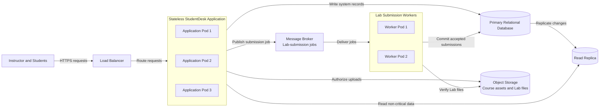
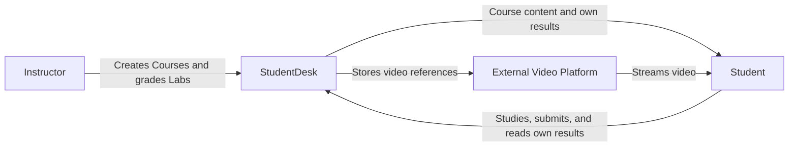
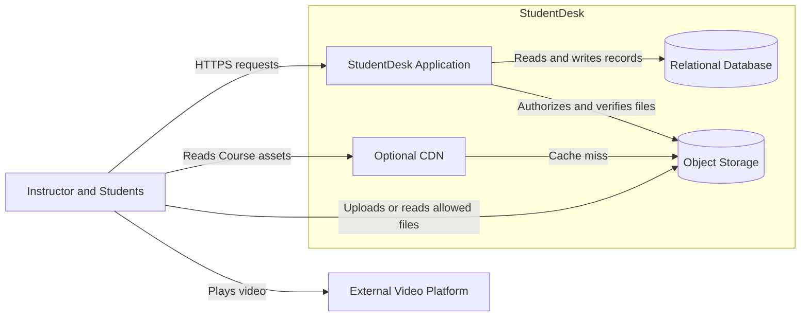
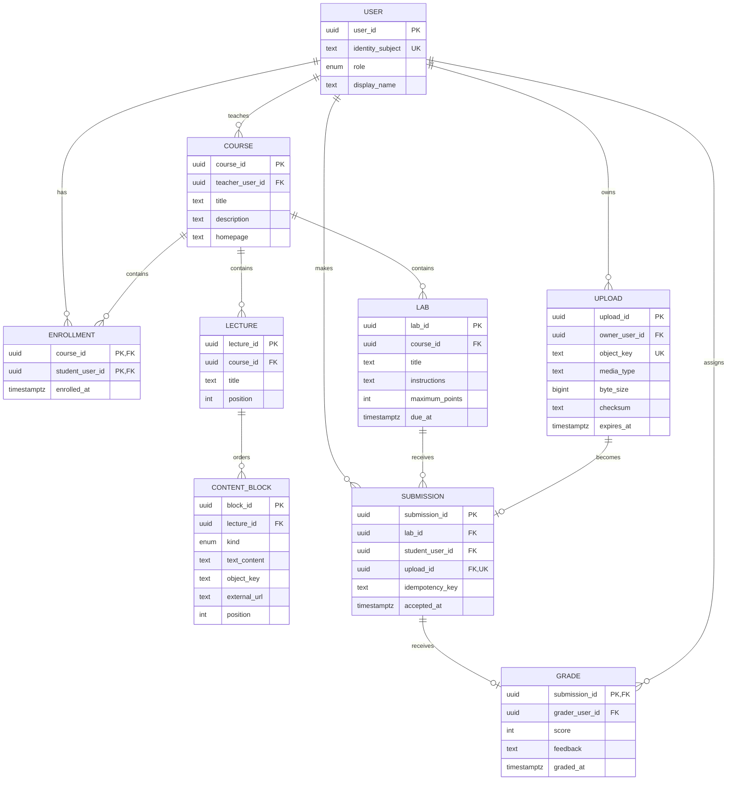
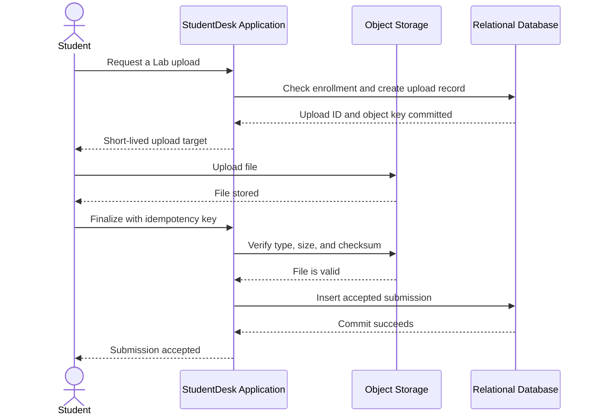
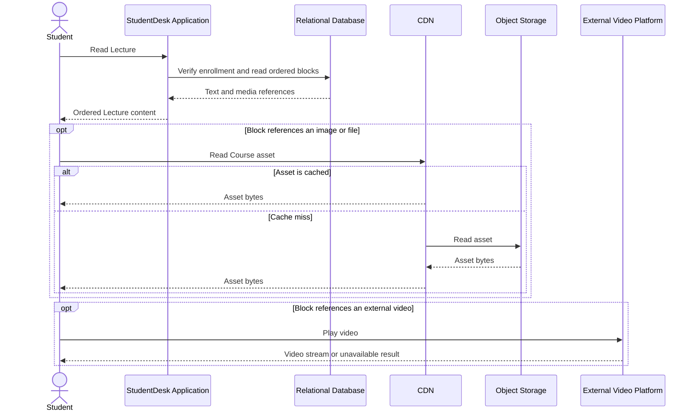
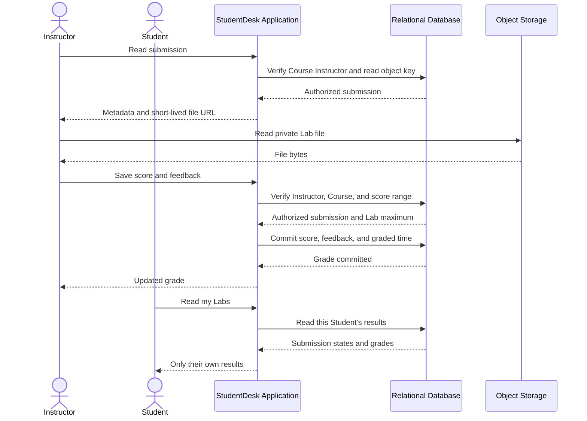
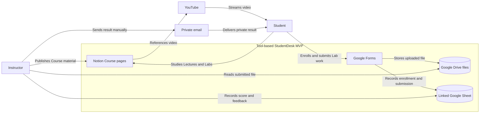

# Lecția 1: Gândirea sistemică și un proiect complet

Acest ghid completează Lecția 1 cu material pentru studiul individual. Folosește
StudentDesk pentru a prezenta un proces complet de proiectare a unui sistem
informatic. Lecțiile următoare studiază fiecare parte mai detaliat.

## Obiective de învățare

După această lecție, studentul trebuie să poată:

- să explice de ce proiectarea începe cu o problemă, nu cu o listă de componente;
- să separe obiectivul produsului, domeniul de aplicare, cerințele funcționale și
  cerințele de calitate;
- să asocieze o estimare a volumului de lucru cu o decizie de proiectare;
- să citească un System View, un Container View, un view asupra datelor și un
  view de secvență;
- să identifice o înregistrare de referință, o invariantă și un punct de succes;
- să explice cum o reîncercare sau defectarea unei dependențe modifică rezultatul
  vizibil pentru Utilizator;
- să explice când devin utile un Load Balancer, replicile Aplicației, un Read
  Replica și procesele Worker de fundal;
- să selecteze cea mai mică versiune care poate testa ideea produsului;
- să își formeze o intuiție despre ce trebuie să conțină un Document de definire
  a domeniului tehnic;
- să compare procese RFC sau ADR cu formalism redus și cu formalism controlat.

## 1. Ce face proiectarea sistemului informatic

Proiectarea sistemului informatic face legătura dintre un rezultat util și o
implementare pe care o echipă o poate construi, revizui și opera.

```text
problema -> cerințe -> proiectare -> implementare -> măsurare
```

Codul singur nu răspunde la aceste întrebări:

- Cine are problema?
- Ce rezultat este util?
- Ce este inclus în domeniul de aplicare?
- Cât de bine trebuie să funcționeze sistemul?
- Ce parte deține fiecare responsabilitate?
- Ce înregistrare stabilește ce s-a întâmplat?
- Ce poate eșua?
- Ce vede Utilizatorul după o eroare?
- Ce dovezi ar modifica proiectarea?

Un proiect nu este o listă de tehnologii. Fiecare parte principală trebuie să
existe datorită unei cerințe, unui volum de lucru, unei reguli de responsabilitate
sau unui caz de defectare.

Proiectarea sistemului informatic se aplică și unui sistem existent. Înainte de a
adăuga o funcționalitate, identifică scopul, limitele, înregistrările, fluxurile,
regulile de acces, dependențele și comportamentul curent în caz de defectare.

## 2. Începe cu partea interesată și problema

O parte interesată este o persoană sau un grup care influențează sistemul sau este
influențat de acesta. O primă versiune cu un domeniu limitat are nevoie de o parte
interesată principală clară și de un rezultat util.

Cererea generală pentru această lecție este:

```text
Construiește o platformă de învățare online.
```

Această cerere poate produce o listă nelimitată de funcționalități. StudentDesk o
înlocuiește cu un obiectiv precis:

> Oferă unui Instructor un loc clar în care să organizeze materialul Cursului și
> să evalueze Laboratoarele. Oferă Studenților săi un loc clar în care să studieze,
> să trimită lucrările de Laborator și să primească rezultatele.

Promisiunea produsului exprimă cel mai mic rezultat complet:

> StudentDesk ajută un Instructor să organizeze Cursuri cu teorie și Laboratoare.
> Studenții înscriși pot studia materialul, pot trimite un fișier pentru fiecare
> Laborator și pot primi propriile note și observații.

Promisiunea este utilă numai dacă domeniul de aplicare o susține.

### Domeniul de aplicare inițial

Sunt incluse:

- pagini de Curs cu Lecții și Laboratoare ordonate;
- înscrierea Studenților;
- trimiterea unui fișier PDF sau ZIP de cel mult 20 MB pentru fiecare Laborator;
- reîncercarea fără crearea unui duplicat al trimiterii acceptate;
- evaluarea de către Instructor cu un punctaj și observații;
- acces privat la rezultatele proprii ale fiecărui Student.

Nu sunt incluse:

- plățile, descoperirea Cursurilor și recenziile publice;
- chatul, forumurile, lecțiile în direct și notificările;
- testele, examenele, evaluarea între colegi și evaluarea automată;
- înregistrarea, transcodarea și redarea în flux a materialelor video;
- mai mulți Profesori, organizații și piețe online.

Obiectivele excluse sunt constrângeri de proiectare. Acestea împiedică
funcționalitățile fără legătură cu scopul să adauge înregistrări, fluxuri,
permisiuni și moduri de defectare noi în primul proiect.

## 3. Transformă promisiunea în cerințe

### Cerințe funcționale

O cerință funcțională descrie un comportament pe care un Utilizator sau un alt
sistem îl poate observa.

Folosește această formă:

```text
Când <actor și declanșator>, sistemul <rezultat observabil>.
Dacă <limită sau defectare>, sistemul <alternativă observabilă>.
```

Exemple:

- Când un Student înscris deschide un Curs, StudentDesk returnează pagina de
  pornire, Lecțiile și Laboratoarele ordonate.
- Când un Student înscris trimite un tip de fișier acceptat pentru Laborator,
  StudentDesk
  acceptă o singură trimitere. Dacă Studentul repetă cererea după pierderea
  răspunsului, StudentDesk returnează aceeași trimitere și nu creează un duplicat.
- Când un Student citește rezultatele Laboratorului, StudentDesk returnează numai
  starea trimiterii, punctajul și observațiile acelui Student. O citire neautorizată
  este respinsă.

Aceste cerințe precizează rezultate. Ele nu selectează un API, o bază de date, un
o memorie cache sau o coadă.

### Cerințe de calitate

O cerință de calitate precizează cât de bine trebuie să funcționeze un rezultat.
O cerință de calitate utilă are trei părți:

```text
măsură + țintă + condiție de operare
```

Lecția 1 introduce patru calități principale:

| Calitate        | Sens simplu                                                                       | Exemplu StudentDesk                                                                                                                                     |
| --------------- | --------------------------------------------------------------------------------- | ------------------------------------------------------------------------------------------------------------------------------------------------------- |
| Latență         | Timpul de la un punct de început definit până la un rezultat definit              | 95% dintre citirile metadatelor Cursului se termină în cel mult 500 ms de la primirea cererii, la maximum 1 citire pe secundă                           |
| Disponibilitate | Proporția încercărilor care returnează un rezultat acceptabil în limita stabilită | Cel puțin 99,9% dintre încercările de citire a Cursului returnează metadate corecte în cel mult 2 secunde, măsurat lunar la maximum 1 citire pe secundă |
| Debit           | Operații finalizate într-o unitate de timp, cu respectarea celorlalte ținte       | Finalizează 1 citire de Curs și 1 finalizare de trimitere pe secundă, cu respectarea țintelor lor de latență și corectitudine                           |
| Consistență     | Regula pentru ce poate arăta o citire înainte și după o scriere                   | După ce StudentDesk confirmă o notă, următoarea citire a rezultatului de către Student arată nota respectivă sau un rezultat clar de indisponibilitate  |

`p95` este percentila 95. Dacă sunt măsurate 100 de cereri comparabile, 95 se
termină într-un timp mai mic sau egal cu valoarea p95. Cele mai lente 5 pot dura
mai mult. p95 nu este media și nu este valoarea maximă.

Un rezultat rapid, dar incorect, nu îndeplinește cerința. De exemplu, un răspuns
HTTP 200 care conține nota altui Student este un eșec, chiar dacă revine în 90 ms.

## 4. Estimează suficient pentru a lua o decizie

O estimare este un model al volumului de lucru așteptat. Nu este o predicție care
trebuie să fie exactă. Scrie ipotezele, unitățile, calculele și incertitudinea.

Ipoteze pentru StudentDesk:

- 1.000 de Utilizatori activi lunar;
- 200 de Utilizatori într-o zi aglomerată;
- 10 citiri de Curs sau Laborator pentru fiecare Utilizator activ;
- cea mai mare parte a activității are loc într-o zi de studiu de 8 ore;
- 1.000 de fișiere de Laborator noi pe lună, cu o medie de 8 MB;
- 500 de redări video externe într-o zi aglomerată, cu o medie de 150 MB.

Estimarea citirilor de metadate:

```text
200 de Utilizatori x 10 citiri = 2.000 de citiri într-o zi aglomerată
2.000 / 28.800 de secunde = aproximativ 0,07 citiri pe secundă
vârf scurt de 10x = sub 1 citire pe secundă
```

Estimarea fișierelor și a materialelor video:

```text
1.000 de fișiere de Laborator x 8 MB = aproximativ 8 GB de fișiere noi pe lună
500 de redări video x 150 MB = aproximativ 75 GB într-o zi aglomerată
```

Volumul metadatelor este mic. Acesta nu justifică microservicii, replici sau un
broker de mesaje. Fișierele și materialele video necesită totuși o decizie de
livrare diferită, deoarece volumul lor în octeți și nevoile de procesare sunt
diferite de cele ale metadatelor.

Concluzii utile:

- o singură Aplicație mică poate gestiona traficul de metadate așteptat;
- stocarea de obiecte este mai potrivită pentru fișiere decât o bază de date
  relațională;
- o platformă video externă evită construirea procesării și redării în flux a
  materialelor video;
- un CDN este opțional până când măsurătorile arată că livrarea resurselor are
  nevoie de acesta;
- instrumentele existente pot susține primul flux de lucru fără software
  personalizat.

### O posibilă arhitectură pentru creșterea măsurată

Volumul de lucru inițial nu necesită arhitectura următoare. Aceasta devine o
opțiune rezonabilă numai după ce traficul măsurat, procesarea trimiterilor sau
cerințele de disponibilitate depășesc capacitatea proiectului simplu.



Fiecare parte răspunde unei presiuni specifice:

- Load Balancer distribuie cererile între Application Pods fără stare.
- Un număr mai mare de Application Pods mărește capacitatea de procesare a
  cererilor și permite defectarea unui Pod fără să oprească toate cererile.
- Primary Relational Database gestionează scrierile, verificările de autorizare
  și citirile care trebuie să includă cea mai recentă scriere.
- Read Replica deservește citirile care nu sunt critice și care pot tolera date
  învechite.
- Message Broker păstrează sarcinile durabile pentru trimiterile de Laborator în
  timpul vârfurilor de trafic.
- Worker Pods verifică fișierele de Laborator și reîncearcă procesarea fără să
  blocheze o cerere API.

Un răspuns care confirmă acceptarea pentru procesare înseamnă că StudentDesk a
stocat o sarcină durabilă. Acesta nu înseamnă că trimiterea de Laborator este
acceptată. Trimiterea devine acceptată numai după ce un Worker verifică fișierul
și confirmă înregistrarea în Primary Relational Database. Regulile de unicitate
și idempotență pentru trimiteri mențin siguranța reîncercărilor efectuate de
Worker.

## 5. Folosește view-uri pentru a răspunde la întrebări diferite

O singură diagramă nu poate explica toate părțile unui sistem. Selectează view-ul
potrivită pentru întrebare.

### System View

System View arată persoanele, sistemul proiectat, sistemele
externe și relațiile dintre acestea.



StudentDesk controlează structura Cursului, înscrierile, trimiterile și notele. Nu
controlează platforma externă, dispozitivul Utilizatorului sau rețeaua
Utilizatorului.

### Container View

Container View prezintă interiorul limitei sistemului. Un container este o
aplicație sau un depozit de date care rulează separat. Acest termen nu implică
utilizarea Docker.

View-ul următor prezintă un posibil sistem personalizat ulterior. Nu este prima
versiune selectată.



Fiecare parte are o responsabilitate principală:

| Parte                    | Responsabilitate                                                                | Limită importantă                                              |
| ------------------------ | ------------------------------------------------------------------------------- | -------------------------------------------------------------- |
| Aplicația StudentDesk    | Autentifică, autorizează, administrează Cursuri, acceptă trimiteri și evaluează | Nu transmite octeții fișierelor mari sau ai materialelor video |
| Bază de date relațională | Stochează Utilizatori, structura Cursului, înscrieri, trimiteri și note         | Nu stochează octeții fișierelor mari                           |
| Stocare de obiecte       | Stochează resursele Cursului și fișierele de Laborator                          | Un obiect stocat nu constituie singur o trimitere acceptată    |
| CDN opțional             | Păstrează în memoria cache și livrează resursele Cursului                       | Nu este necesar pentru volumul de lucru inițial                |
| Platforma video externă  | Stochează, procesează și redă materialul video în flux                          | StudentDesk nu îi poate garanta disponibilitatea               |

### View-ul asupra datelor

View-ul asupra datelor asociază acțiunile Utilizatorului cu înregistrări, câmpuri
și relații stabile. Acest model aparține etapei ulterioare a Aplicației
personalizate. MVP-ul bazat pe instrumente păstrează informații echivalente în
Notion, Forms, Drive și o Foaie de calcul asociată.



Constrângeri importante:

- `(course_id, student_user_id)` este unic pentru înscriere;
- `(lab_id, student_user_id)` este unic pentru o trimitere acceptată;
- `(student_user_id, idempotency_key)` este unic pentru reîncercările trimiterii;
- o încărcare poate deveni cel mult o trimitere;
- o trimitere are zero sau o notă curentă;
- nota stochează Instructorul care a acordat-o;
- un bloc de conținut folosește numai câmpul care corespunde tipului său: text,
  fișier, imagine sau material video extern.

### Suprafața API

O suprafață API asociază acțiunile cu regulile de acces și de înregistrare. Aceasta
nu înlocuiește cerințele.

| Acțiune                    | Exemplu de metodă și cale                  | Regula principală                                                                   |
| -------------------------- | ------------------------------------------ | ----------------------------------------------------------------------------------- |
| Citește Cursul             | `GET /v1/courses/{courseId}`               | Solicită Instructorul Cursului sau un Student înscris                               |
| Solicită încărcare         | `POST /v1/uploads`                         | Returnează o destinație temporară deținută de Utilizatorul autentificat             |
| Trimite Laboratorul        | `POST /v1/labs/{labId}/submissions`        | Solicită înscrierea, o încărcare verificată și o cheie de idempotentă               |
| Evaluează trimiterea       | `PUT /v1/submissions/{submissionId}/grade` | Solicită Instructorul Cursului și un punctaj valid                                  |
| Citește Laboratoarele mele | `GET /v1/courses/{courseId}/my-labs`       | Obține identitatea Studentului din sesiune și returnează numai rezultatele acestuia |

Cursul complet folosește și view-uri ale componentelor, stărilor, evenimentelor și
view-uri mai detaliate asupra datelor. Fiecare view trebuie să fie consecvent cu
cerințele și cu celelalte view-uri.

## 6. Definește înregistrările, regulile și succesul

O înregistrare de referință este înregistrarea folosită pentru a stabili ce s-a
întâmplat. O invariantă este o regulă care trebuie să rămână întotdeauna adevărată.

StudentDesk are această invariantă centrală:

> O trimitere de Laborator este acceptată numai după ce fișierul său există în
> stocarea de obiecte, iar înregistrarea trimiterii este confirmată durabil.

Baza de date relațională stochează înregistrarea trimiterii acceptate. Stocarea de
obiecte păstrează octeții fișierului. Înregistrarea conține cheia obiectului, suma
de control, dimensiunea și ora acceptării. Această separare păstrează starea
acceptată și fișierul mare în tipul de stocare potrivit fiecărei responsabilități.

Regula principală de acces este:

> Numai Instructorul Cursului poate evalua o trimitere. Numai Studentul respectiv
> și Instructorul Cursului îi pot citi fișierul, punctajul și observațiile.

Autentificarea răspunde la întrebarea "Cine este acest Utilizator?" Autorizarea
răspunde la întrebarea "Poate acest Utilizator să efectueze această acțiune asupra
acestei resurse?" Un Utilizator autentificat nu are automat permisiunea să citească
fiecare Curs sau să acorde note.

## 7. Urmărește secvența critică și defectările

Un view de secvență verifică dacă părțile pot produce rezultatul cerut. De
asemenea, marchează punctul exact de succes.

Secvența următoare aparține proiectului personalizat simplu. În proiectul pentru
creștere, Aplicația publică o sarcină durabilă, iar un Worker verifică fișierul și
confirmă înregistrarea în baza de date. În ambele proiecte, confirmarea în baza de
date este punctul de succes al trimiterii.



Trimiterea devine acceptată la confirmarea tranzacției în baza de date. Încărcarea
singură nu este suficientă.

### Secvența de citire a conținutului Cursului

Această secvență separă înregistrările mici ale Cursului de livrarea fișierelor și
a materialelor video.



StudentDesk poate returna textul ordonat chiar dacă o imagine sau un material
video nu este disponibil. Ținta sa de disponibilitate trebuie să precizeze ce
rezultat este obligatoriu.

### Secvența de evaluare și citire a notei

Această secvență arată verificările de confidențialitate și punctul care stabilește
nota.



Nota devine curentă la confirmarea tranzacției în baza de date. Pagina deschisă
anterior de Student poate conține date vechi, fără să modifice nota confirmată.

Cazuri importante de defectare:

- Încărcarea fișierului reușește, dar finalizarea eșuează. Operația poate fi
  reîncercată sau fișierul poate fi eliminat ulterior. Încă nu există o trimitere
  acceptată.
- Confirmarea reușește, dar răspunsul se pierde. O reîncercare cu aceeași cheie de
  idempotentă returnează trimiterea inițială.
- Platforma video externă se defectează. StudentDesk poate păstra disponibile
  textul Cursului și Laboratoarele și poate arăta că materialul video nu este
  disponibil.
- Un Utilizator neautorizat solicită o notă. StudentDesk respinge cererea și nu
  returnează date private.

O reîncercare idempotentă înseamnă că repetarea aceleiași operații intenționate are
același efect intenționat. Nu înseamnă că fiecare cerere de rețea repetată este
sigură în absența unei reguli sau înregistrări a Aplicației.

## 8. Selectează cea mai mică versiune utilă

Un proiect poate concluziona că software-ul personalizat nu este primul pas
corect. StudentDesk poate testa întregul flux de lucru cu instrumente existente:

| Necesitate                                            | Implementare inițială                                     |
| ----------------------------------------------------- | --------------------------------------------------------- |
| Pagina de pornire, Lecții și Laboratoare ale Cursului | Pagini Notion doar pentru citire                          |
| Material video                                        | Materiale video YouTube încorporate                       |
| Imagini și descărcări                                 | Atașamente Notion sau linkuri Google Drive                |
| Înscriere                                             | Formular Google cu adresa de e-mail a Studentului         |
| Trimiterea Laboratorului                              | Formular Google cu încărcare de fișier în Google Drive    |
| Catalog                                               | Foaie de calcul Google asociată Formularului de trimitere |
| Notă și observații                                    | Mesaj e-mail privat către Student                         |

Diagrama arată cum instrumentele formează un singur flux de lucru. Săgețile nu
înseamnă că fiecare pas este automat.



Această versiune poate răspunde la întrebări practice:

- Pot Studenții să găsească materialul?
- Pot trimite lucrările fără confuzie?
- Poate Instructorul să asocieze fiecare fișier cu Studentul și Laboratorul
  corect?
- Poate Instructorul să returneze observații private?
- Ce sarcină manuală repetată consumă suficient timp pentru a fi automatizată?

O Aplicație personalizată devine utilă după ce versiunea inițială arată o problemă
clară de flux de lucru, acces sau fiabilitate pe care instrumentele existente nu o
rezolvă.

## 9. Înregistrează decizia

Un Document de definire a domeniului tehnic face proiectul ușor de revizuit înainte
de implementare. Acesta conține:

1. contextul, partea interesată, problema și obiectivul produsului;
2. promisiunea produsului, domeniul de aplicare și obiectivele excluse;
3. actorii, regulile de acces și cerințele observabile;
4. țintele de calitate și ipotezele despre volumul de lucru;
5. limita sistemului și view-urile arhitecturii;
6. înregistrările importante, invariantele și fluxurile critice;
7. versiunea inițială și etapele ulterioare;
8. alternativele, compromisurile și comportamentul în caz de defectare;
9. metoda de validare și întrebările deschise.

### Cum înregistrează companiile deciziile de inginerie

Exemplele următoare trec de la un nivel redus de formalism la un nivel ridicat
de formalism. Această ordine nu este un clasament al calității. O decizie mică
și reversibilă necesită mai puțin control decât o decizie costisitoare care
afectează multe echipe.

- [ADR-urile Spotify](https://engineering.atspotify.com/2020/04/when-should-i-write-an-architecture-decision-record):
  Selectate de echipă. Câteva echipe folosesc ADR-uri pentru decizii
  semnificative. Decizia poate apărea mai întâi într-un RFC sau într-o ședință
  tehnică.
- [RFC-urile tehnice Shopify](https://shopify.engineering/running-engineering-program-guide):
  Ad-hoc și limitate în timp. Inginerii folosesc un șablon asincron GitHub
  pentru un domeniu tehnic precis. Dacă nu există un veto explicit până la
  termenul-limită, autorul RFC-ului decide cum continuă procesul.
- [Fluxul de proiectare a arhitecturii GitLab](https://handbook.gitlab.com/handbook/engineering/architecture/workflow/):
  Proporțional și iterativ. Fluxul formal este destinat schimbărilor complexe
  sau care implică mai multe echipe. Un document de proiectare poate începe cu
  un paragraf, poate evolua odată cu implementarea și poate fi revizuit printr-o
  cerere de îmbinare.
- [Documentele de proiectare Google](https://abseil.io/resources/swe-book/html/ch10.html#design-docs):
  Obligatorii pentru majoritatea proiectelor importante. Echipele folosesc un
  șablon aprobat și revizuiesc propunerea înainte de implementare. Specialiștii
  pot revizui securitatea, confidențialitatea, stocarea și alte aspecte
  importante.
- [Înregistrările deciziilor de arhitectură AWS](https://docs.aws.amazon.com/prescriptive-guidance/latest/architectural-decision-records/adr-process.html):
  Ciclu de viață controlat. Fiecare decizie importantă pentru arhitectură
  folosește un șablon de proiect, un responsabil, revizuirea echipei și o stare.
  Un ADR acceptat nu poate fi modificat. O decizie ulterioară trebuie să îl
  înlocuiască printr-un ADR nou.

Selectează nivelul de structură în funcție de costul unei decizii greșite, de
numărul echipelor afectate, de dificultatea anulării deciziei și de dovezile de
revizuire necesare pentru decizie.

Decizia curentă pentru StudentDesk este:

> Începe cu instrumentele existente pentru Cursuri și trimiteri. Măsoară unde se
> pierd Studenții și unde Instructorul repetă munca manuală. Construiește software
> personalizat numai când aceste dovezi identifică o problemă precisă.

## 10. Termeni principali

| Termen                    | Sens                                                                                     |
| ------------------------- | ---------------------------------------------------------------------------------------- |
| Parte interesată          | Persoană sau grup care influențează sistemul sau este influențat de acesta               |
| Promisiunea produsului    | Cel mai mic rezultat complet și util pentru un Utilizator                                |
| Cerință funcțională       | Comportament observabil al sistemului                                                    |
| Cerință de calitate       | Condiție măsurabilă pentru cât de bine funcționează un rezultat                          |
| Limita sistemului         | Linia dintre ce controlează sistemul și lucrurile de care depinde                        |
| Înregistrare de referință | Înregistrare folosită pentru a stabili ce s-a întâmplat                                  |
| Invariantă                | Regula care trebuie să rămână întotdeauna adevărată                                      |
| Reîncercare idempotentă   | Repetarea unei operații intenționate are același efect intenționat                       |
| Dependență externă        | Sistem pe care proiectul îl folosește, dar nu îl controlează                             |
| Read Replica              | Copie a bazei de date care deservește citiri și poate rămâne în urma bazei principale    |
| Message Broker            | Componentă care stochează și livrează mesaje de lucru                                    |
| Worker                    | Proces de fundal care preia și finalizează sarcini din coadă                             |
| RFC                       | Request for Comments folosit pentru revizuirea unei schimbări propuse                    |
| ADR                       | Architecture Decision Record care păstrează o decizie și motivul acesteia                |
| p95                       | Prag respectat de 95% dintre măsurătorile comparabile                                    |
| MVP                       | Cea mai mică versiune sau experiment care poate testa rezultatul principal al produsului |
| Mermaid                   | Notație text care generează diagrame                                                     |

## 11. Surse și studiu suplimentar

Aceste resurse externe susțin conceptele și notația din această lecție:

- [Prezentare generală a părților interesate ale unui proiect](https://en.wikipedia.org/wiki/Project_stakeholder)
  - o introducere scurtă despre părțile interesate și relația lor cu un proiect;
- [Manualul NASA de inginerie a sistemelor](https://www.nasa.gov/reference/systems-engineering-handbook/)
  - așteptările părților interesate, cerințele, arhitectura, verificarea și
    validarea într-un singur proces de inginerie;
- [Diagramele modelului C4](https://c4model.com/diagrams)
  - scopul și nivelul de detaliu pentru System View, Container View și view-urile
    de componente și de cod;
- [Manualul Google SRE: Implementarea SLO-urilor](https://sre.google/workbook/implementing-slos/)
  - indicatori de serviciu măsurabili, ținte și motivul asocierii lor cu
    rezultate vizibile pentru Utilizator;
- [Ghid introductiv Mermaid](https://mermaid.js.org/intro/getting-started.html)
  - notația text pentru diagrame folosită în acest curs;
- [Ce este SDLC](https://aws.amazon.com/what-is/sdlc/)
- [Arhitectura calculatoarelor](https://neetcode.io/courses/system-design-for-beginners/0)
- [Arhitectura aplicațiilor](https://neetcode.io/courses/system-design-for-beginners/1)

- [Ce este un interviu de proiectare a sistemelor](https://www.designgurus.io/course-play/grokking-the-system-design-interview/doc/what-is-a-system-design-interview)
- [Introducere în proiectarea sistemelor](https://neetcode.io/courses/system-design-interview/0)
- [Introducere în interviul de proiectare a sistemelor](https://www.designgurus.io/course-play/grokking-the-system-design-interview/doc/system-design-interviews-a-step-by-step-guide)
- [Cum să proiectezi o clonă Twitter](https://neetcode.io/courses/system-design-interview/3)

Cărți:

- _System Design Interview - An Insider's Guide_
- _Designing Data-Intensive Applications_ de Martin Kleppmann

Resursele pentru interviuri arată moduri uzuale de a comunica un proiect sub
presiunea timpului. Acestea nu înlocuiesc metoda cursului, cerințele proiectului
sau nevoia de a justifica fiecare decizie cu dovezi din sistemul curent.

## Acțiunea următoare

Citește [documentul de predare al proiectului de curs](../course-project/README-ro.md). Trimite
două propuneri de proiect cu domeniu limitat înainte de primul Laborator. Nu
proiecta încă arhitectura.
