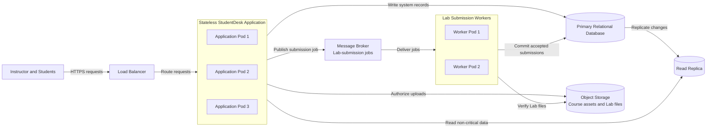
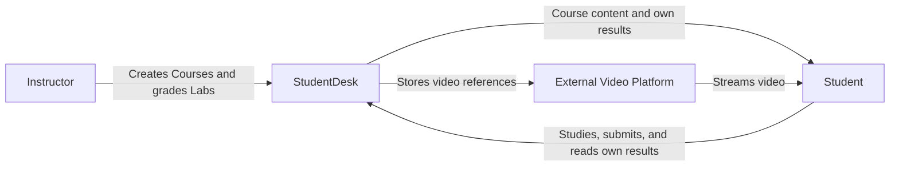
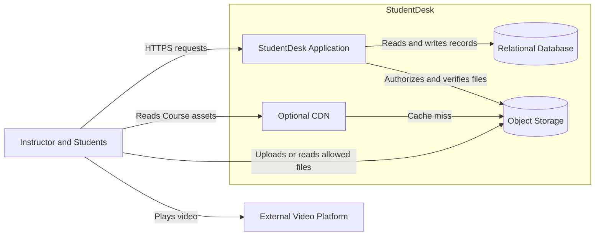
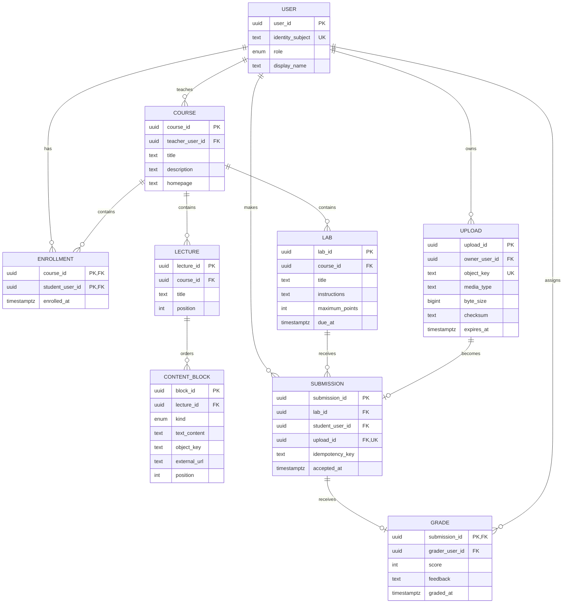
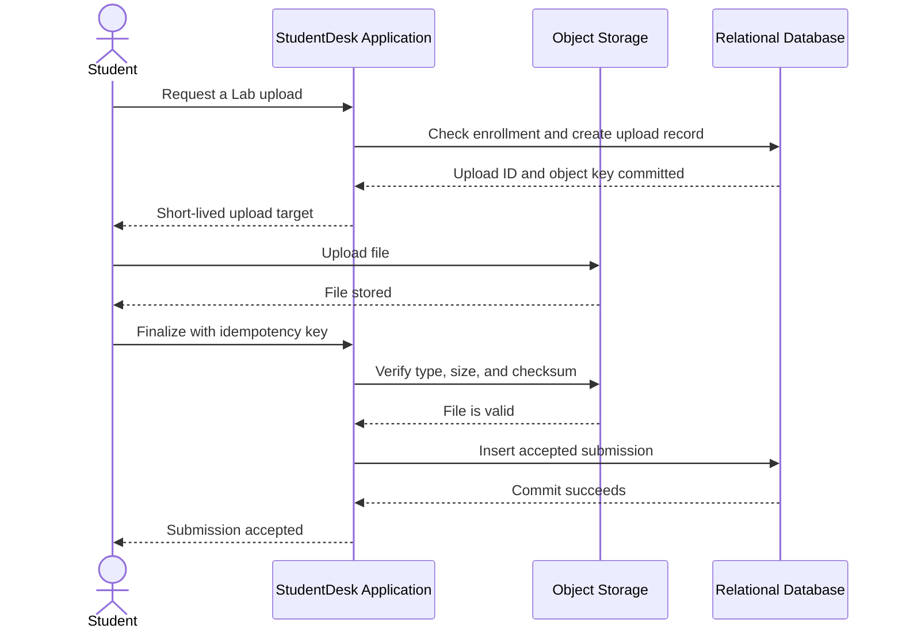
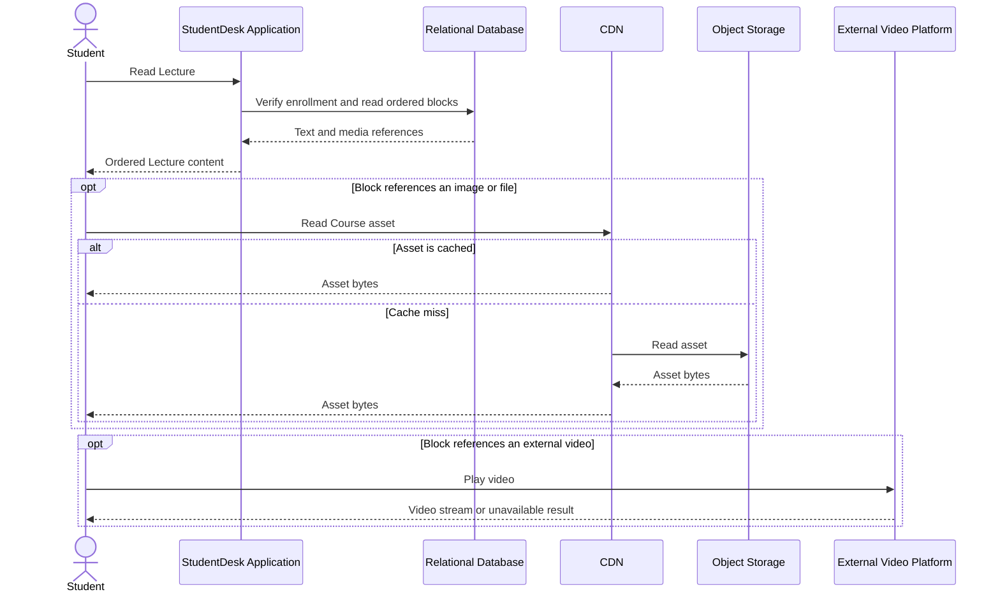
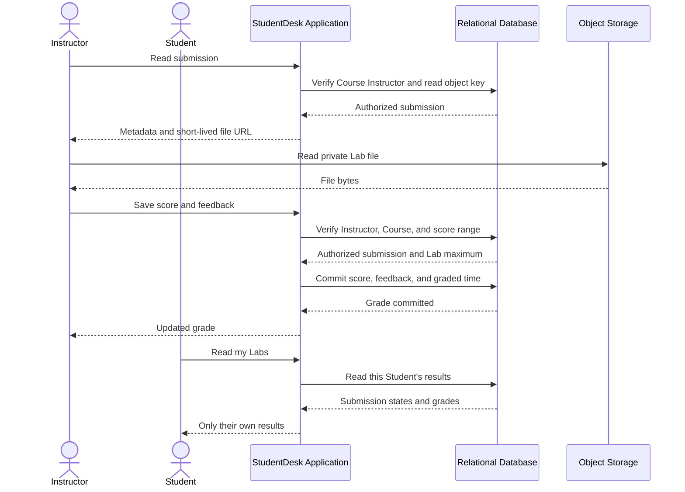
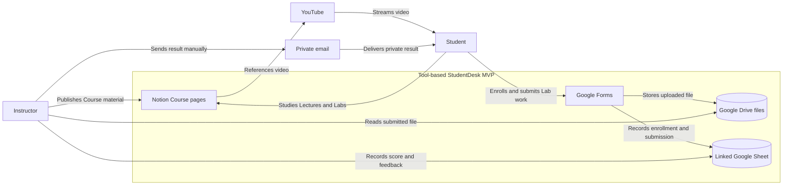

# Lecture 1: Systems Thinking and a Complete Design

This guide is the home-reading companion for Lecture 1. It uses StudentDesk to
show one complete system-design process. Later lectures study each part in more
detail.

## Learning goals

After this lecture, a student should be able to:

- explain why a design starts with a problem and not a component list;
- separate a product goal, scope, functional requirements, and quality
requirements;
- connect a workload estimate to a design decision;
- read a System Context, Container, data, and sequence view;
- identify a system of record, an invariant, and a success point;
- explain how a retry or dependency failure changes a User-visible result;
- explain when a Load Balancer, Application replicas, a Read Replica, and
  background Workers become useful;
- select the smallest release that can test the product idea;
- develop an intuition on what belongs in an Engineering Scoping Document;
- compare lightweight and controlled RFC or ADR processes.

## 1. What system design does

System design connects a useful result to an implementation that a team can
build, review, and operate.

```text
problem -> requirements -> design -> implementation -> measurement
```

Code alone does not answer these questions:

- Who has the problem?
- Which result is useful?
- What is in scope?
- How well must the system work?
- Which part owns each responsibility?
- Which record settles what happened?
- What can fail?
- What does the User see after a failure?
- Which evidence would change the design?

A design is not a list of technologies. Each major part must exist because of
a requirement, a workload, an ownership rule, or a failure case.

System design also applies to an existing system. Before adding a feature,
identify the current purpose, boundaries, records, flows, access rules,
dependencies, and failure behavior.

## 2. Start with the stakeholder and the problem

A stakeholder is a person or group that affects the system or is affected by
it. A bounded first release needs one clear main stakeholder and one useful
result.

The broad request for this lecture is:

```text
Build an online learning platform.
```

This request can produce an unlimited feature list. StudentDesk replaces it
with a focused goal:

> Give one Instructor a clear place to organize Course material and grade
> Labs. Give their Students a clear place to study, submit Lab work, and
> receive results.

The product promise states the smallest end-to-end result:

> StudentDesk helps one Instructor organize Courses with theory and Labs.
> Enrolled Students can study the material, submit one file for each Lab, and
> receive their own grades and feedback.

The promise is useful only when the scope supports it.

### Initial scope

In scope:

- Course pages with ordered Lectures and Labs;
- Student enrollment;
- one PDF or ZIP submission of at most 20 MB for each Lab;
- retry without a duplicate accepted submission;
- Instructor grading with a score and feedback;
- private access to each Student's own results.

Out of scope:

- payments, Course discovery, and public reviews;
- chat, forums, live classes, and notifications;
- quizzes, exams, peer review, and automatic grading;
- video recording, transcoding, and streaming;
- multiple Teachers, organizations, and marketplaces.

Non-goals are design constraints. They prevent unrelated features from adding
new records, flows, permissions, and failure modes to the first design.

## 3. Turn the promise into requirements

### Functional requirements

A functional requirement describes behavior that a User or another system can
observe.

Use this form:

```text
When <actor and trigger>, the system <observable result>.
If <boundary or failure>, the system <observable alternative>.
```

Examples:

- When an enrolled Student opens a Course, StudentDesk returns its homepage,
ordered Lectures, and Labs.
- When an enrolled Student submits a supported Lab file, StudentDesk accepts
one submission. If the Student repeats the request after a lost response,
StudentDesk returns the same submission and does not create a duplicate.
- When a Student reads Lab results, StudentDesk returns only that Student's
submission state, score, and feedback. An unauthorized read is rejected.

These requirements state results. They do not select an API, database, cache,
or queue.

### Quality requirements

A quality requirement states how well a result must work. A useful quality
requirement has three parts:

```text
measure + target + operating condition
```

Lecture 1 introduces four core qualities:

| Quality      | Plain meaning                                                            | StudentDesk example                                                                                                          |
| ------------ | ------------------------------------------------------------------------ | ---------------------------------------------------------------------------------------------------------------------------- |
| Latency      | Time from a defined start to a defined result                            | 95% of Course metadata reads finish within 500 ms from request receipt, at up to 1 read per second                           |
| Availability | Share of attempts that return an acceptable result within the limit      | At least 99.9% of Course-read attempts return correct metadata within 2 seconds, measured monthly at up to 1 read per second |
| Throughput   | Completed operations per unit of time while the other targets still hold | Complete 1 Course read and 1 submission finalization per second while their latency and correctness targets still hold       |
| Consistency  | Rule for what a read can show before and after a write                   | After StudentDesk confirms a grade, the Student's next result read shows that grade or a clear unavailable result            |

`p95` is the 95th percentile. If 100 comparable requests are measured, 95
finish at or below the p95 time. The slowest 5 can take longer. p95 is not the
average and is not the maximum.

A fast incorrect result does not meet the requirement. For example, an HTTP
200 response that contains another Student's grade is a failure even when it
returns in 90 ms.

## 4. Estimate enough to make a decision

An estimate is a model of the expected workload. It is not a prediction that
must be exact. Write the assumptions, units, calculations, and uncertainty.

StudentDesk assumptions:

- 1,000 monthly active Users;
- 200 Users on a busy day;
- 10 Course or Lab reads for each active User;
- most activity in an 8-hour teaching day;
- 1,000 new Lab files per month at an average of 8 MB;
- 500 external video plays on a busy day at an average of 150 MB.

Metadata read estimate:

```text
200 Users x 10 reads = 2,000 reads per busy day
2,000 / 28,800 seconds = about 0.07 reads per second
10x short burst = below 1 read per second
```

File and video estimate:

```text
1,000 Lab files x 8 MB = about 8 GB of new files per month
500 video plays x 150 MB = about 75 GB on a busy day
```

The metadata load is small. It does not justify microservices, replicas, or a
message broker. Files and videos still need a different delivery decision
because their byte volume and processing needs differ from metadata.

Useful conclusions:

- one small Application can handle the expected metadata traffic;
- Object Storage is a better fit for files than a Relational Database;
- an external video platform avoids building video processing and streaming;
- a CDN is optional until measured asset delivery needs it;
- existing tools can support the first workflow without custom software.

### A possible design for measured growth

The initial workload does not need the following architecture. It becomes a
reasonable option only after measured traffic, submission processing, or
availability needs exceed the simple design.



Each part responds to a specific pressure:

- The Load Balancer spreads requests across stateless Application Pods.
- More Application Pods increase request capacity and let one Pod fail without
  stopping every request.
- The Primary Relational Database handles writes, authorization checks, and
  reads that must include the latest write.
- The Read Replica serves non-critical reads that can tolerate stale data.
- The Message Broker holds durable Lab-submission jobs during traffic bursts.
- Worker Pods verify Lab files and retry processing without blocking an API
  request.

An accepted-for-processing response means that StudentDesk stored a durable
job. It does not mean that the Lab submission is accepted. The submission
becomes accepted only after a Worker verifies the file and commits the record
to the Primary Relational Database. Unique submission and idempotency rules
keep Worker retries safe.

## 5. Use views to answer different questions

One diagram cannot explain every part of a system. Select a view for the
question.

### System Context view

The System Context view shows people, the system under design, external
systems, and their relationships.



StudentDesk controls Course structure, enrollment, submissions, and grades. It
does not control the external platform, the User device, or the User network.

### Container view

The Container view opens the system boundary. A container is a separately
running application or data store. It is not a Docker requirement.

The following view is a possible later custom system. It is not the selected
first release.



Each part has one main responsibility:

| Part                    | Responsibility                                                         | Important limit                                     |
| ----------------------- | ---------------------------------------------------------------------- | --------------------------------------------------- |
| StudentDesk Application | Authenticate, authorize, manage Courses, accept submissions, and grade | Does not stream large file or video bytes           |
| Relational Database     | Store Users, Course structure, enrollment, submissions, and grades     | Does not store large file bytes                     |
| Object Storage          | Store Course assets and Lab files                                      | A stored object alone is not an accepted submission |
| Optional CDN            | Cache and deliver Course assets                                        | Not required for the initial workload               |
| External Video Platform | Store, process, and stream video                                       | StudentDesk cannot guarantee its availability       |

### Data view

The data view connects User actions to stable records, fields, and
relationships. This model belongs to the later custom-Application milestone.
The tool-based MVP keeps equivalent information in Notion, Forms, Drive, and a
linked Sheet.



Important constraints:

- `(course_id, student_user_id)` is unique for enrollment;
- `(lab_id, student_user_id)` is unique for an accepted submission;
- `(student_user_id, idempotency_key)` is unique for submission retries;
- one upload can become at most one submission;
- one submission has zero or one current grade;
- the grade stores the Teacher who assigned it;
- a content block uses only the field that matches its text, file, image, or
external-video kind.

### API surface

An API surface connects actions to access and record rules. It does not replace
the requirements.

| Action           | Example method and path                    | Main rule                                                              |
| ---------------- | ------------------------------------------ | ---------------------------------------------------------------------- |
| Read Course      | `GET /v1/courses/{courseId}`               | Require the Course Instructor or an enrolled Student                   |
| Request upload   | `POST /v1/uploads`                         | Return a short-lived target owned by the signed-in User                |
| Submit Lab       | `POST /v1/labs/{labId}/submissions`        | Require enrollment, a verified upload, and an idempotency key          |
| Grade submission | `PUT /v1/submissions/{submissionId}/grade` | Require the Course Instructor and a valid score                        |
| Read my Labs     | `GET /v1/courses/{courseId}/my-labs`       | Derive Student identity from the session and return only their results |

The complete course also uses Component, state, event, and more detailed data
views. Each view must stay consistent with the requirements and with the other
views.

## 6. Define records, rules, and success

A system of record is the record used to settle what happened. An invariant is
a rule that must always remain true.

StudentDesk has this central invariant:

> A Lab submission is accepted only after its file exists in Object Storage
> and the submission record is durably committed.

The Relational Database stores the accepted submission record. Object Storage
stores the file bytes. The record contains the object key, checksum, size, and
accepted time. This separation keeps the accepted state and the large file in
the storage type that fits each responsibility.

The main access rule is:

> Only the Course Instructor can grade a submission. Only that Student and the
> Course Instructor can read its file, score, and feedback.

Authentication answers, "Who is this User?" Authorization answers, "Can this
User perform this action on this resource?" A signed-in User is not
automatically allowed to read every Course or grade.

## 7. Trace the critical sequence and failures

A sequence view tests whether the parts can produce the required result. It
also marks the exact success point.

The following sequence belongs to the simple custom design. In the growth
design, the Application publishes a durable job and a Worker performs the file
verification and database commit. Both designs use the database commit as the
submission success point.



The submission becomes accepted at the database commit. The upload alone is
not enough.

### Course-content read sequence

This sequence separates small Course records from file and video delivery.



StudentDesk can return ordered text even when an image or video is
unavailable. Its availability target must state which result is required.

### Grading and grade-read sequence

This sequence shows the privacy checks and the point that settles the grade.



The grade becomes current at the database commit. The Student's earlier page
can be stale without changing the committed grade.

Important failure cases:

- The file upload succeeds but finalization fails. The file can be retried or
removed later. No accepted submission exists yet.
- The commit succeeds but the response is lost. A retry with the same
idempotency key returns the original submission.
- The external video platform fails. StudentDesk can keep Course text and Labs
available and show that the video is unavailable.
- An unauthorized User requests a grade. StudentDesk rejects the request and
does not return private data.

Idempotent retry means that repeating the same intended operation has the same
intended effect. It does not mean that every repeated network request is safe
without an application rule or record.

## 8. Select the smallest useful release

A design can conclude that custom software is not the correct first step.
StudentDesk can test the complete workflow with existing tools:

| Need                                | Initial implementation                      |
| ----------------------------------- | ------------------------------------------- |
| Course homepage, Lectures, and Labs | Read-only Notion pages                      |
| Video                               | Embedded YouTube videos                     |
| Images and downloads                | Notion attachments or Google Drive links    |
| Enrollment                          | Google Form with the Student email          |
| Lab submission                      | Google Form with a Google Drive file upload |
| Gradebook                           | Google Sheet linked to the submission Form  |
| Grade and feedback                  | Private email to the Student                |

The diagram shows how the tools form one workflow. Arrows do not mean that
every step is automatic.



This release can answer practical questions:

- Can Students find the material?
- Can they submit work without confusion?
- Can the Instructor connect each file to the correct Student and Lab?
- Can the Instructor return private feedback?
- Which repeated manual task consumes enough time to automate?

A custom Application becomes useful after the initial release shows a clear
workflow, access, or reliability problem that existing tools do not solve.

## 9. Record the decision

An Engineering Scoping Document makes the design reviewable before
implementation. It contains:

1. context, stakeholder, problem, and product goal;
2. product promise, scope, and non-goals;
3. actors, access rules, and observable requirements;
4. quality targets and workload assumptions;
5. system boundary and architecture views;
6. important records, invariants, and critical flows;
7. initial release and later milestones;
8. alternatives, tradeoffs, and failure behavior;
9. validation method and open questions.

### How companies record engineering decisions

The following examples move from low ceremony to high ceremony. This order is
not a quality ranking. A small reversible decision needs less control than a
costly decision that affects many teams.

- [Spotify ADRs](https://engineering.atspotify.com/2020/04/when-should-i-write-an-architecture-decision-record):
  Team-selected. A handful of teams use ADRs for significant decisions. The
  decision can first emerge from an RFC or an engineering meeting.
- [Shopify engineering RFCs](https://shopify.engineering/running-engineering-program-guide):
  Ad hoc and time-boxed. Engineers use an asynchronous GitHub template for a
  focused technical area. If there is no explicit veto by the deadline, the
  RFC author decides how to proceed.
- [GitLab architecture design workflow](https://handbook.gitlab.com/handbook/engineering/architecture/workflow/):
  Proportional and iterative. The formal workflow is for complex or cross-team
  changes. A design document can start as one paragraph, evolve with
  implementation, and receive review through a merge request.
- [Google design documents](https://abseil.io/resources/swe-book/html/ch10.html#design-docs):
  Required for most major projects. Teams use an approved template and review
  the proposal before implementation. Specialists can review security,
  privacy, storage, and other important concerns.
- [AWS architectural decision records](https://docs.aws.amazon.com/prescriptive-guidance/latest/architectural-decision-records/adr-process.html):
  Controlled lifecycle. Each architecturally significant decision uses a
  project template, an owner, team review, and a status. An accepted ADR is
  immutable; a later decision must supersede it with a new ADR.

Select the amount of structure from the cost of a wrong decision, the number
of affected teams, the difficulty of reversal, and the review evidence that
the decision needs.

The current StudentDesk decision is:

> Start with existing Course and submission tools. Measure where Students get
> lost and where the Instructor repeats manual work. Build custom software only
> when that evidence identifies a specific problem.

## 10. Key terms

| Term                   | Meaning                                                              |
| ---------------------- | -------------------------------------------------------------------- |
| Stakeholder            | Person or group that affects the system or is affected by it         |
| Product promise        | Smallest useful end-to-end result for a User                         |
| Functional requirement | Observable system behavior                                           |
| Quality requirement    | Measurable condition for how well a result works                     |
| System boundary        | Line between what the system controls and what it depends on         |
| System of record       | Record used to settle what happened                                  |
| Invariant              | Rule that must always remain true                                    |
| Idempotent retry       | Repeating one intended operation has the same intended effect        |
| External dependency    | System that the design uses but does not control                     |
| Read Replica           | Database copy that serves reads and can lag behind the Primary       |
| Message Broker         | Component that stores and delivers work messages                     |
| Worker                 | Background process that consumes and completes queued work           |
| RFC                    | Request for Comments used to review a proposed change                |
| ADR                    | Architecture Decision Record that stores a decision and its reason   |
| p95                    | Value that 95% of comparable measurements meet or beat               |
| MVP                    | Smallest release or experiment that can test the main product result |
| Mermaid                | Text notation that renders diagrams                                  |

## 11. Sources and further study

These external resources support the concepts and notation in this lecture:

- [Project stakeholder overview](https://en.wikipedia.org/wiki/Project_stakeholder)
  - a short introduction to stakeholders and their relationship to a project;
- [NASA Systems Engineering Handbook](https://www.nasa.gov/reference/systems-engineering-handbook/)
  - stakeholder expectations, requirements, architecture, verification, and
  validation in one engineering process;
- [C4 model diagrams](https://c4model.com/diagrams)
  - the purpose and level of detail of System Context, Container, Component,
  and code views;
- [Google SRE Workbook: Implementing SLOs](https://sre.google/workbook/implementing-slos/)
  - measurable service indicators, targets, and the reason to connect them to
  User-visible results;
- [Mermaid getting started guide](https://mermaid.js.org/intro/getting-started.html)
  - the text-based diagram notation used in this course;
- [What is SDLC](https://aws.amazon.com/what-is/sdlc/)
- [Computer Architecture](https://neetcode.io/courses/system-design-for-beginners/0)
- [Application Architecture](https://neetcode.io/courses/system-design-for-beginners/1)

- [What is a System Design Interview](https://www.designgurus.io/course-play/grokking-the-system-design-interview/doc/what-is-a-system-design-interview)
- [Introduction to System Design](https://neetcode.io/courses/system-design-interview/0)
- [Introduction to System Design Interview](https://www.designgurus.io/course-play/grokking-the-system-design-interview/doc/system-design-interviews-a-step-by-step-guide)
- [How to design a Twitter clone](https://neetcode.io/courses/system-design-interview/3)

Books:

- *System Design Interview - An Insider's Guide*
- *Designing Data-Intensive Applications* by Martin Kleppmann

The interview resources show common ways to communicate a design under time
pressure. They do not replace the course method, project requirements, or the
need to justify each decision with the current system's evidence.

## Next action

Read the [course-project handoff](../course-project/README.md). Submit two bounded
project candidates before the first Lab. Do not design the architecture yet.
