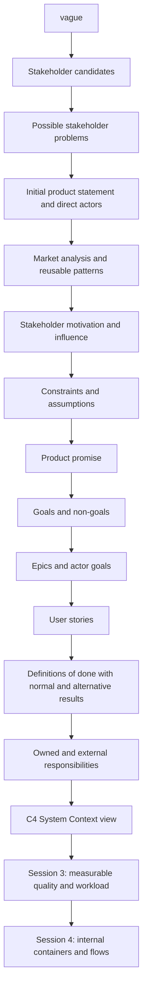
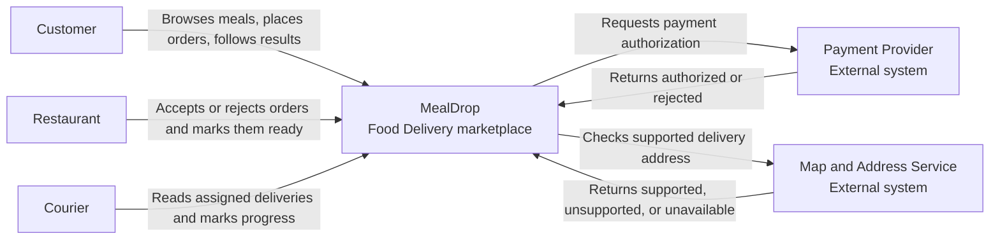

# Lecția 2: Domeniul de aplicare al produsului, actorii și limitele sistemului

Acest ghid este materialul de lectură pentru acasă care însoțește Lecția 2. Acesta
folosește MealDrop pentru a arăta cum o cerere vagă devine un contract restrâns al
produsului și un System Context view.

Această lecție rămâne în afara sistemului. Ea nu selectează arhitectura internă
sau tehnologia.

## Obiective de învățare

După această lecție, un Student trebuie să poată:

- să explice de ce o cerere vagă nu este pregătită pentru proiectarea sistemului
  informatic;
- să folosească dovezi publice despre produse pentru a compara interpretări
  diferite ale unei piețe;
- să separe o parte interesată de un actor;
- să precizeze actorul, problema, rezultatul util, constrângerea și ipoteza;
- să scrie o promisiune precisă a produsului;
- să separe obiectivele de obiectivele excluse;
- să împartă o epică largă în obiective mai mici ale actorilor și povești de
  Utilizator;
- să adauge unei povești de Utilizator rezultate normale și alternative care
  pot fi observate;
- să separe responsabilitățile deținute de responsabilitățile externe;
- să identifice o dependență externă și rezultatul defectării pe care îl vede
  Utilizatorul;
- să citească și să deseneze un C4 System Context view.

## 1. Începe cu problema produsului

Cererea inițială pentru această lecție este:

```text
Construiește o aplicație care ajută oamenii să comande mâncare.
```

Această cerere numește un subiect. Ea nu răspunde la întrebările necesare pentru
o proiectare:

- Cine este afectat de produs?
- Cine va interacționa cu acesta?
- Ce problemă trebuie să rezolve prima versiune?
- Ce rezultat este util?
- Ce este lăsat intenționat în afara primei versiuni?
- Ce responsabilități aparțin produsului?
- Ce rezultate depind de sisteme din afara limitei produsului?

Dacă aceste răspunsuri lipsesc, o echipă poate crea o listă lungă de
funcționalități fără să ajungă la un acord asupra produsului.

Folosește acest lanț de raționament:



Fiecare pas restrânge problema. De asemenea, acesta creează dovezi pentru pasul
următor.

## 2. Folosește cercetarea pieței ca dovadă

Cercetarea pieței poate arăta moduri diferite de a interpreta aceeași cerere
vagă. Ea nu definește produsul tău și nu dezvăluie arhitectura internă a altui
produs.

Lecția compară două descrieri publice de produse:

- [Toast Online Ordering](https://pos.toasttab.com/products/online-ordering/)
  este centrat pe canalul de comandă directă al unui Restaurant.
- [Glovo](https://glovoapp.com/) conectează Clienți, companii și Curieri.

Comparația susține o decizie:

```text
MealDrop va explora livrarea printr-o piață online într-un singur oraș, cu trei
actori direcți.
```

### O metodă scurtă de cercetare

Înainte să deschizi paginile produselor, scrie o întrebare:

```text
Cum interpretează produsele existente cererea "ajută oamenii să comande mâncare"?
```

Pentru fiecare produs, înregistrează:

1. principalul Utilizator sau principala parte interesată probabilă;
2. rezultatul util;
3. un model reutilizabil al produsului;

Apoi conectează fiecare model selectat la o problemă pe care o va rezolva
produsul tău. Înregistrează afirmațiile fără dovezi ca ipoteze, nu ca fapte.

MealDrop selectează aceste modele:

- verifică dacă zona de livrare este acceptată;
- arată numai Restaurantele și preparatele disponibile;
- arată clar progresul comenzii actorilor relevanți.

MealDrop amână ridicarea comenzii, comenzile programate, promoțiile, alte
categorii de produse și operațiunile de asistență.

## 3. Separă părțile interesate de actori

O parte interesată este o persoană sau un grup care este afectat de produs sau
care poate modifica o decizie privind produsul.

Un actor este o persoană sau un sistem extern care interacționează direct cu
sistemul.

Un actor este de obicei o parte interesată, dar o parte interesată nu trebuie să
fie un actor.

| Candidat                               | Parte interesată? | Actor direct? | Motiv                                                         |
| -------------------------------------- | ----------------- | ------------- | ------------------------------------------------------------- |
| Client                                 | Da                | Da            | Plasează o comandă și citește rezultatul acesteia             |
| Restaurant                             | Da                | Da            | Acceptă sau respinge o comandă și îi modifică starea          |
| Curier                                 | Da                | Da            | Citește o alocare și modifică starea livrării                 |
| Proprietarul produsului MealDrop       | Da                | Nu            | Ia decizii despre produs, dar nu participă la fluxul comenzii |
| Autoritatea de reglementare a orașului | Da                | Nu            | Poate impune limite, dar nu folosește direct MealDrop         |

Această clasificare este importantă deoarece numai actorii direcți și sistemele
externe conectate direct aparțin în System Context view.

### Motivație și influență

O hartă a părților interesate ajută echipa să decidă cum să implice fiecare parte
interesată:

- Motivația arată cât de mult îi pasă părții interesate, cât de mult este
  afectată sau cât de mult depinde de rezultat.
- Influența arată cât de mult poate partea interesată să permită, să blocheze, să
  întârzie sau să modifice rezultatul.

Folosește motivul pentru o poziționare, nu numai eticheta ridicată sau scăzută.
Revizuiește harta când se modifică domeniul de aplicare al produsului sau
dovezile.

| Motivație | Influență scăzută | Influență ridicată      |
| --------- | ----------------- | ----------------------- |
| Ridicată  | Consultă          | Gestionează îndeaproape |
| Scăzută   | Informează        | Menține satisfacția     |

[Ghidul Guvernului Regatului Unit pentru cartografierea părților interesate](https://analysisfunction.civilservice.gov.uk/policy-store/stakeholder-mapping/)
descrie puterea sau influența, interesul sau motivația și cele patru grupuri de
implicare folosite aici.

## 4. Scrie promisiunea și domeniul de aplicare ale produsului

O promisiune a produsului precizează cel mai mic rezultat util complet. Ea trebuie
să numească Utilizatorii principali, problema lor și rezultatul util.

Folosește această formă:

```text
<Produs> ajută <Utilizatorii principali> să rezolve <problema>, astfel încât
<rezultatul util>.
```

Promisiunea produsului MealDrop este:

> **MealDrop** ajută **Clienții** dintr-un singur oraș **să comande cu livrare**
> de la Restaurante participante, în timp ce Restaurantele și Curierii alocați
> actualizează comanda, **astfel încât fiecare actor să poată vedea rezultatul
> curent de la plasare până la livrare**.

Promisiunea numește un flux limitat. Ea nu numește un ecran, o componentă sau o
tehnologie.

### Obiective

Un obiectiv precizează un rezultat pe care prima versiune trebuie să îl ofere.
Actorul trebuie să poată observa când rezultatul este complet.

Obiectivele MealDrop:

- arată Restaurantele participante și preparatele care sunt disponibile pentru
  comandă;
- permite unui Client să plaseze o comandă cu livrare la o adresă acceptată;
- permite unui Restaurant să accepte sau să respingă comanda și să o marcheze ca
  pregătită;
- permite unui Curier alocat să marcheze comanda ca ridicată sau livrată;
- arată fiecărui actor rezultatul curent al comenzii care este relevant pentru
  activitatea sa.

Scrie "Permite unui Restaurant să respingă o comandă", nu "Construiește un tablou
de bord pentru Restaurant". Prima afirmație este un rezultat. A doua afirmație
propune o interfață.

### Obiective excluse

Un obiectiv exclus precizează ce nu acceptă intenționat această versiune a
produsului. Acesta înseamnă "nu acum", nu "niciodată".

Obiectivele excluse pentru MealDrop:

- gestionarea angajării Curierilor, a salariilor, a turelor, a vehiculelor sau a
  operațiunilor flotei;
- oferirea de publicitate pentru Restaurante, recenzii, recomandări sau programe
  de fidelitate;
- acceptarea ridicării comenzii, a comenzilor programate, a comenzilor de grup
  sau a mai multor orașe.

Un obiectiv exclus util elimină din prima versiune un actor, o regulă, o stare sau
un caz de defectare. O preferință tehnologică precum "nu folosi microservicii" nu
este un obiectiv exclus al produsului.

### Constrângeri și ipoteze

O constrângere este o limită fixă pe care produsul trebuie să o respecte. O
ipoteză este o afirmație neverificată care poate fi greșită.

| Tip          | Exemplu MealDrop                                                                      |
| ------------ | ------------------------------------------------------------------------------------- |
| Constrângere | Prima versiune deservește un singur oraș                                              |
| Constrângere | Prima versiune acceptă numai livrarea                                                 |
| Constrângere | Apar numai Restaurantele participante                                                 |
| Ipoteză      | Sistemele de plată și de adrese returnează un rezultat utilizabil                     |
| Ipoteză      | Disponibilitatea preparatelor Restaurantului este suficient de actuală pentru comandă |
| Ipoteză      | O livrare acceptată poate primi o singură alocare de Curier                           |

Constrângerile restrâng proiectarea. Ipotezele necesită validare ulterioară. Nu
prezenta o ipoteză ca fapt confirmat.

## 5. Transformă obiectivele actorilor în cerințe observabile

O epică este un rezultat larg al unui actor, care este prea mare pentru o singură
poveste de Utilizator. Împarte-o în obiective mai mici ale actorului, care pot
produce rezultate utile.

MealDrop folosește trei epici:

| Epică                             | Obiective mai mici ale actorului                                        |
| --------------------------------- | ----------------------------------------------------------------------- |
| Descoperă și comandă mâncare      | Răsfoiește mâncarea disponibilă; plasează o comandă; primește o decizie |
| Îndeplinește o comandă cu livrare | Decide și pregătește comanda; o ridică și o livrează                    |
| Urmărește progresul comenzii      | Vede rezultatul curent de la acceptare până la livrare                  |

O poveste de Utilizator precizează intenția și valoarea actorului:

```text
Ca <actor>, vreau <obiectiv>, astfel încât <rezultat util>.
```

O poveste este punctul de început al unei conversații. Ea nu este singură o
cerință completă. Definiția de Făcut face rezultatul așteptat observabil și
verificabil.

[Ghidul Agile Alliance pentru poveștile de Utilizator](https://agilealliance.org/glossary/user-stories/)
și [Three Cs](https://agilealliance.org/glossary/three-cs/) separă:

- Card: povestea scurtă de Utilizator;
- Conversation: sensul, limitele și alternativele sale importante;
- Confirmation: verificările care arată că povestea este finalizată.

### Definiția de Făcut

Pentru fiecare poveste, scrie între două și patru verificări care acoperă:

- rezultatul normal observabil;
- rezultatele alternative importante;
- o limită de acces sau de domeniu de aplicare, când este relevantă;
- nicio alegere de implementare.

Folosește aceste întrebări pentru revizuire:

- Observabil: actorul sau un test poate vedea rezultatul?
- Clar: fiecare termen important are un singur sens?
- Limitat: sunt incluse alternativele importante?
- Testabil: poți descrie un exemplu care trece și unul care nu trece?
- Fără implementare: precizează ce se întâmplă în loc de cum este construit?

### Exemplu MealDrop

Obiectivul actorului:

```text
Clientul trebuie să plaseze o comandă și să afle dacă aceasta va fi pregătită.
```

Povestea de Utilizator:

```text
Ca Client, vreau să plasez o comandă la o adresă acceptată și să primesc un
rezultat clar, astfel încât să știu dacă aceasta va fi pregătită.
```

Definițiile de Făcut:

- Arată comanda ca acceptată numai după ce plata este autorizată și Restaurantul
  o acceptă.
- Dacă adresa nu este acceptată, arată că livrarea nu este acceptată și nu arăta
  comanda ca acceptată.
- Dacă plata sau Restaurantul respinge comanda, arată respingerea corectă și nu
  arăta comanda ca acceptată.
- Dacă lipsește un rezultat necesar, arată starea în așteptare sau indisponibilă
  și nu inventa un rezultat de succes.

Verificările nu selectează un API, o bază de date, o coadă, un ecran sau un
serviciu. Ele precizează ce poate observa Clientul.

### Forma cerinței funcționale

De asemenea, poți reformula o poveste și verificările sale ca o singură cerință
funcțională:

```text
Când <actor și declanșator>, sistemul <rezultat observabil>.
Dacă <limită sau defectare>, sistemul <alternativă observabilă>.
```

Povestea explică valoarea. Forma cerinței face explicit comportamentul. În
Laboratorul 1, păstrează numele secțiunii "Cerințe funcționale" și folosește
povești de Utilizator cu definiții de Făcut.

## 6. Precizează explicit rezultatele alternative

Un succes fals este mai dăunător decât un rezultat clar indisponibil sau respins.
Nu combina rezultate care necesită acțiuni diferite din partea Utilizatorului.

| Situație                                    | Rezultat clar                  |
| ------------------------------------------- | ------------------------------ |
| Adresa este în afara zonei de livrare       | Neacceptată                    |
| Furnizorul de plăți respinge plata          | Plata a fost respinsă          |
| Restaurantul respinge comanda               | Restaurantul a respins comanda |
| Lipsește un rezultat extern necesar         | În așteptare sau indisponibil  |
| Un Restaurant fără legătură citește comanda | Neautorizat                    |
| Este returnată o stare mai veche            | Învechită, nu curentă          |

Produsul deține ce văd Utilizatorii săi, chiar și atunci când un sistem extern
deține decizia sursă. De exemplu, Furnizorul de plăți decide dacă plata este
autorizată. MealDrop deține în continuare aceste responsabilități:

- solicită rezultatul;
- îl interpretează în fluxul produsului;
- previne transformarea unui rezultat necunoscut într-un succes fals;
- arată Clientului un rezultat clar.

## 7. Definește limita sistemului prin responsabilități

Limita sistemului separă responsabilitățile pe care le deține produsul de
responsabilitățile deținute de persoane sau sisteme externe.

| În interiorul limitei MealDrop                              | În afara limitei MealDrop                                              |
| ----------------------------------------------------------- | ---------------------------------------------------------------------- |
| Arată Restaurantele participante și preparatele disponibile | Restaurantele furnizează disponibilitatea și pregătesc mâncarea        |
| Validează o comandă și arată rezultatul ei curent           | Clienții furnizează adresa, selecțiile de preparate și metoda de plată |
| Aplică actualizările actorilor autorizați comenzii corecte  | Restaurantele iau decizii; Curierii ridică și livrează mâncarea        |
| Solicită și interpretează autorizarea plății                | Furnizorul de plăți decide dacă plata este autorizată                  |
| Solicită și interpretează verificarea unei adrese           | Serviciul de hărți și adrese întreține datele despre hărți și adrese   |

Extern nu înseamnă neimportant. Înseamnă că MealDrop trebuie să depindă de un
rezultat controlat de alt proprietar.

Pentru fiecare dependență externă, întreabă:

1. Ce rezultat deținut are nevoie de aceasta?
2. Ce rezultat sursă furnizează?
3. Ce vede Utilizatorul când rezultatul este respins, lipsește sau este învechit?
4. Ce responsabilitate rămâne în interiorul produsului?

## 8. Desenează un C4 System Context view

Modelul C4 folosește niveluri de focalizare pentru a răspunde la întrebări
diferite:

| Nivel          | Întrebarea principală                                        | Utilizare în curs                            |
| -------------- | ------------------------------------------------------------ | -------------------------------------------- |
| System Context | Cine folosește sistemul și ce sisteme folosește acesta?      | Lecția 2                                     |
| Container      | Ce părți principale de execuție și stocări sunt în interior? | Lecția 4                                     |
| Component      | Ce părți principale există într-un container?                | Detalii ulterioare, când sunt utile          |
| Code           | Cum este implementată o componentă?                          | În afara view-urilor principale ale cursului |

Un System Context view conține:

- un sistem de interes;
- actorii săi umani direcți;
- sistemele externe conectate direct;
- un scop pentru fiecare relație.

[Ghidul C4 System Context](https://c4model.com/diagrams/system-context) folosește
un view îndepărtat. Acesta nu arată tehnologii, protocoale sau detalii interne.



Citește view-ul din exterior:

1. MealDrop este sistemul de interes.
2. Customer, Restaurant și Courier sunt actori umani.
3. Fiecare relație cu un actor precizează un scop al produsului.
4. Payment Provider și Map and Address Service sunt sisteme externe.
5. Săgețile arată rezultatul de care MealDrop are nevoie de la fiecare sistem
   extern.

Nu pune aceste elemente într-un System Context view:

- browser sau aplicație mobilă;
- API sau protocol de rețea;
- bază de date, memorie cache, coadă sau broker de mesaje;
- serviciu intern;
- regiune de implementare sau produs cloud.

Aceste elemente răspund la întrebări despre arhitectura internă. Lecția 4
introduce Container View, care poate arăta părțile principale din interiorul
limitei.

## 9. Păstrează consecvent contractul produsului

Rezultatul lecției este un contract al produsului, nu o arhitectură internă.

```text
dovezi
  -> problema părții interesate
  -> promisiunea produsului
  -> obiective și obiective excluse
  -> obiectivele actorilor și poveștile de Utilizator
  -> definițiile de Făcut
  -> responsabilități deținute și externe
  -> System Context view
```

Folosește aceste verificări de consecvență:

- Fiecare obiectiv susține promisiunea produsului.
- Fiecare poveste susține cel puțin un obiectiv.
- Nicio poveste nu implementează un obiectiv exclus.
- Fiecare rezultat normal sau alternativ important este observabil.
- Fiecare relație externă susține o poveste sau o responsabilitate deținută.
- Tabelul limitei și Context view descriu același sistem.
- Nicio tehnologie nu apare înainte ca o nevoie a produsului să o justifice.

Lecția 3 va adăuga cerințe de calitate măsurabile și ipoteze despre volumul de
lucru. Lecția 4 va deschide limita și va selecta Containerele interne.

## 10. Termeni principali

| Termen                 | Sens                                                                                     |
| ---------------------- | ---------------------------------------------------------------------------------------- |
| Parte interesată       | Persoană sau grup afectat de produs ori capabil să modifice o decizie                    |
| Actor                  | Persoană sau sistem extern care interacționează direct cu sistemul                       |
| Promisiunea produsului | O propoziție care numește Utilizatorii, problema și rezultatul util                      |
| Obiectiv               | Rezultat pe care prima versiune trebuie să îl accepte                                    |
| Obiectiv exclus        | Rezultat pe care prima versiune nu îl acceptă intenționat                                |
| Constrângere           | Limită pe care proiectarea trebuie să o respecte                                         |
| Ipoteză                | Afirmație folosită acum, care încă necesită dovezi                                       |
| Epică                  | Rezultat larg al unui actor, care trebuie împărțit în povești mai mici                   |
| Poveste de Utilizator  | Afirmație scurtă despre obiectivul și valoarea unui actor                                |
| Definiția de Făcut     | Verificări observabile care trebuie să fie adevărate înainte ca povestea să fie completă |
| Rezultat alternativ    | Ce vede actorul când rezultatul normal nu poate avea loc                                 |
| Limita sistemului      | Linia dintre responsabilitățile deținute și cele externe                                 |
| Dependență externă     | Sistem folosit de produs, dar controlat de alt proprietar                                |
| System Context view    | View cu persoane, un sistem, sisteme externe și relațiile lor                            |

## 11. Surse și studiu suplimentar

Aceste resurse externe susțin conceptele și exemplele din această lecție:

- [Ghidul Guvernului Regatului Unit pentru cartografierea părților interesate](https://analysisfunction.civilservice.gov.uk/policy-store/stakeholder-mapping/)
  - identificarea părților interesate, motivația sau interesul, influența sau
    puterea și grupurile de implicare;
- [Ghidul Agile Alliance pentru poveștile de Utilizator](https://agilealliance.org/glossary/user-stories/)
  - povești de Utilizator ca descrieri scurte, orientate spre valoare;
- [Three Cs de la Agile Alliance](https://agilealliance.org/glossary/three-cs/)
  - Card, Conversation și Confirmation;
- [Ghidul Agile Alliance pentru epici](https://agilealliance.org/glossary/epic/)
  - povești largi care trebuie împărțite în povești mai mici;
- [Ghidul Atlassian pentru epici și povești](https://www.atlassian.com/agile/project-management/epics-stories-themes)
  - o explicație suplimentară despre gruparea poveștilor asociate;
- [Introducere în modelul C4](https://c4model.com/)
  - cele patru niveluri de focalizare C4 și scopul lor;
- [Ghidul C4 System Context](https://c4model.com/diagrams/system-context)
  - sistemul de interes, Utilizatorii săi, sistemele externe și relațiile directe;
- [Toast Online Ordering](https://pos.toasttab.com/products/online-ordering/)
  - dovezi publice pentru o interpretare a comenzilor directe, centrată pe
    Restaurant;
- [Glovo](https://glovoapp.com/) și
  [întrebările frecvente Glovo](https://glovoapp.com/docs/en/faq/)
  - dovezi publice pentru o interpretare de piață online și livrare prin Curier.

Paginile produselor se pot modifica. Folosește-le ca dovezi curente, nu ca o
specificație permanentă.

## Acțiunea următoare

Finalizează [Laboratorul 1: Definește produsul inițial](../labs/01-product-framing/README-ro.md).
Aplică metoda pentru Personal Investment Dashboard. Nu copia actorii, poveștile
sau sistemele externe ale MealDrop.
