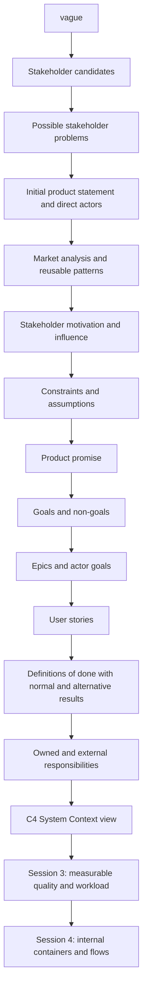
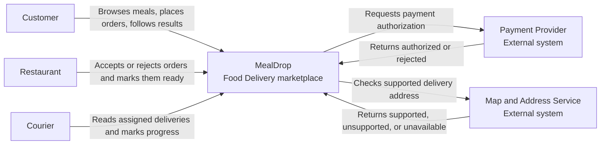

# Lecture 2: Product Scope, Actors, and System Boundaries

This guide is the home-reading companion for Lecture 2. It uses MealDrop to
show how a vague request becomes a small product contract and a System Context
view.

This lecture stays outside the system. It does not select internal architecture
or technology.

## Learning goals

After this lecture, a student should be able to:

- explain why a vague request is not ready for system design;
- use public product evidence to compare different interpretations of a
market;
- separate a stakeholder from an actor;
- state the actor, problem, useful result, constraint, and assumption;
- write one focused product promise;
- separate goals from non-goals;
- split a broad epic into smaller actor goals and user stories;
- add observable normal and alternative results to a user story;
- separate owned responsibilities from external responsibilities;
- identify an external dependency and its User-visible failure result;
- read and draw a C4 System Context view.


## 1. Start with the product problem

The starting request for this lecture is:

```text
Build an app that helps people order food.
```

This request names a topic. It does not answer the questions needed for a
design:

- Who is affected by the product?
- Who will interact with it?
- Which problem should the first version solve?
- What result is useful?
- What is intentionally outside the first version?
- Which responsibilities belong to the product?
- Which results depend on systems outside the product boundary?

If these answers are missing, a team can create a long feature list without
agreeing on the product.

Use this reasoning chain:




Each step narrows the problem. It also creates evidence for the next step.

## 2. Use market research as evidence

Market research can show different ways to interpret the same vague request.
It does not define your product and it does not reveal another product's
internal architecture.

The lecture compares two public product descriptions:

- [Toast Online Ordering](https://pos.toasttab.com/products/online-ordering/) centers a Restaurant's direct ordering channel.
- [Glovo](https://glovoapp.com/) connects Customers, businesses, and Couriers.

The comparison supports one decision:

```text
MealDrop will explore one-city marketplace delivery with three direct actors.
```


### A small research method

Before opening product pages, write one question:

```text
How do existing products interpret "help people order food"?
```

For each product, record:

1. the likely main User or stakeholder;
2. the useful result;
3. one reusable product pattern;

Then connect each selected pattern to a problem that your product will solve.
Record unsupported claims as assumptions, not facts.

MealDrop selects these patterns:

- check whether the delivery area is supported;
- show only available Restaurants and meals;
- show clear order progress to the relevant actors.

MealDrop defers pickup, scheduled orders, promotions, other product categories,
and support operations.

## 3. Separate stakeholders from actors

A stakeholder is a person or group that is affected by the product or can
change a product decision.

An actor is a person or external system that directly interacts with the
system.

An actor is usually a stakeholder, but a stakeholder does not need to be an
actor.


| Candidate              | Stakeholder? | Direct actor? | Reason                                                  |
| ---------------------- | ------------ | ------------- | ------------------------------------------------------- |
| Customer               | Yes          | Yes           | Places an order and reads its result                    |
| Restaurant             | Yes          | Yes           | Accepts or rejects an order and changes its status      |
| Courier                | Yes          | Yes           | Reads an assignment and changes delivery status         |
| MealDrop product owner | Yes          | No            | Makes product decisions but is not in the order journey |
| City regulator         | Yes          | No            | Can impose limits but does not directly use MealDrop    |


This classification matters because only direct actors and directly connected
external systems belong in the System Context view.

### Motivation and influence

A stakeholder map helps a team decide how to involve each stakeholder:

- Motivation is how much the stakeholder cares, is affected, or relies on the
result.
- Influence is how much the stakeholder can enable, block, delay, or change
the result.

Use the reason for a placement, not only a high or low label. Review the map
when the product scope or evidence changes.


| Motivation | Low influence | High influence |
| ---------- | ------------- | -------------- |
| High       | Consult with  | Manage closely |
| Low        | Keep informed | Keep satisfied |


The [UK Government stakeholder-mapping guide](https://analysisfunction.civilservice.gov.uk/policy-store/stakeholder-mapping/)
describes power or influence, interest or motivation, and the four engagement
groups used here.

## 4. Write the product promise and scope

A product promise states the smallest useful end-to-end result. It must name
the main Users, their problem, and the useful result.

Use this form:

```text
<Product> helps <main Users> solve <problem> so that <useful result>.
```

MealDrop's product promise is:

> **MealDrop** helps **Customers** in one city **order delivery** from participating Restaurants, while Restaurants and assigned Couriers update the order, **so that every actor can see the current result from placement to delivery**.

The promise names a bounded journey. It does not name a screen, component, or
technology.

### Goals

A goal states a result that the first version must provide. The actor must be
able to observe when the result is complete.

MealDrop goals:

- show participating Restaurants and meals that are available to order;
- let a Customer place one delivery order to a supported address;
- let a Restaurant accept or reject the order and mark it ready;
- let an assigned Courier mark the order collected or delivered;
- show each actor the current order result relevant to their work.

Write "Let a Restaurant reject an order," not "Build a Restaurant dashboard."
The first statement is a result. The second statement proposes an interface.

### Non-goals

A non-goal states what this product version intentionally does not support. It
means "not now," not "never."

MealDrop non-goals:

- manage Courier hiring, payroll, shifts, vehicles, or fleet operations;
- provide Restaurant advertising, reviews, recommendations, or loyalty plans;
- support pickup, scheduled orders, group orders, or multiple cities.

A useful non-goal removes an actor, rule, state, or failure case from the first
version. A technology preference such as "do not use microservices" is not a
product non-goal.

### Constraints and assumptions

A constraint is a fixed limit that the product must obey. An assumption is an
unverified claim that can be wrong.


| Type       | MealDrop example                                        |
| ---------- | ------------------------------------------------------- |
| Constraint | The first version serves one city                       |
| Constraint | The first version supports delivery only                |
| Constraint | Only participating Restaurants appear                   |
| Assumption | Payment and address systems return a usable result      |
| Assumption | Restaurant meal availability is current enough to order |
| Assumption | An accepted delivery can receive one Courier assignment |


Constraints narrow the design. Assumptions need later validation. Do not
present an assumption as a confirmed fact.

## 5. Turn actor goals into observable requirements

An epic is a broad actor outcome that is too large for one user story. Split it
into smaller actor goals that can produce useful results.

MealDrop uses three epics:


| Epic                     | Smaller actor goals                                       |
| ------------------------ | --------------------------------------------------------- |
| Discover and order food  | Browse available food; place an order; receive a decision |
| Fulfill a delivery order | Decide and prepare the order; collect and deliver it      |
| Follow order progress    | See the current result from acceptance through delivery   |


A user story states actor intent and value:

```text
As a <actor>, I want <goal>, so that <useful result>.
```

A story is a starting point for a conversation. It is not a complete
requirement by itself. The definition of done makes the expected result
observable and checkable.

The [Agile Alliance user-story guide](https://agilealliance.org/glossary/user-stories/)
and its [Three Cs](https://agilealliance.org/glossary/three-cs/) separate:

- Card: the short user story;
- Conversation: its meaning, boundaries, and important alternatives;
- Confirmation: the checks that show the story is complete.


### Definition of done

For each story, write two to four checks that cover:

- the observable normal result;
- important alternative results;
- an access or scope limit when relevant;
- no implementation choices.

Use these review questions:

- Observable: can the actor or a test see the result?
- Clear: does each important term have one meaning?
- Bounded: are important alternatives included?
- Testable: can you describe one pass and one fail example?
- Implementation-free: does it say what happens instead of how it is built?


### MealDrop example

Actor goal:

```text
The Customer needs to place an order and learn whether it will be prepared.
```

User story:

```text
As a Customer, I want to place an order to a supported address and receive a
clear result so that I know whether it will be prepared.
```

Definitions of done:

- Show the order as accepted only after payment is authorized and the
Restaurant accepts it.
- If the address is unsupported, show that delivery is not supported and do
not show the order as accepted.
- If payment or the Restaurant rejects the order, show the correct rejection
and do not show the order as accepted.
- If a required result is missing, show pending or unavailable and do not
invent a successful result.

The checks do not select an API, database, queue, screen, or service. They
state what the Customer can observe.

### Functional-requirement form

You can also restate a story and its checks as one functional requirement:

```text
When <actor and trigger>, the system <observable result>.
If <boundary or failure>, the system <observable alternative>.
```

The story explains value. The requirement form makes behavior explicit. In
Lab 1, keep the section name "Functional requirements" and use user stories
with definitions of done.

## 6. Make alternative results explicit

A false success is more harmful than a clear unavailable or rejected result.
Do not merge outcomes that require different User actions.


| Situation                                | Clear result           |
| ---------------------------------------- | ---------------------- |
| The address is outside the delivery area | Unsupported            |
| The Payment Provider rejects the payment | Payment rejected       |
| The Restaurant rejects the order         | Restaurant rejected    |
| A required external result is missing    | Pending or unavailable |
| An unrelated Restaurant reads the order  | Unauthorized           |
| An older status is returned              | Stale, not current     |


The product owns what its Users see even when an external system owns the
source decision. For example, the Payment Provider decides whether payment is
authorized. MealDrop still owns these responsibilities:

- request the result;
- interpret it in the product journey;
- prevent an unknown result from becoming a false success;
- show the Customer a clear result.


## 7. Define the system boundary through responsibilities

The system boundary separates responsibilities the product owns from
responsibilities owned by people or external systems.


| Inside the MealDrop boundary                        | Outside the MealDrop boundary                                    |
| --------------------------------------------------- | ---------------------------------------------------------------- |
| Show participating Restaurants and available meals  | Restaurants supply availability and prepare food                 |
| Validate an order and show its current result       | Customers supply their address, meal choices, and payment method |
| Apply authorized actor updates to the correct order | Restaurants make decisions; Couriers collect and deliver food    |
| Request and interpret payment authorization         | Payment Provider decides whether payment is authorized           |
| Request and interpret an address check              | Map and Address Service maintains map and address data           |


External does not mean unimportant. It means that MealDrop must depend on a
result that another owner controls.

For each external dependency, ask:

1. Which owned result needs it?
2. Which source result does it provide?
3. What does the User see when that result is rejected, missing, or stale?
4. Which responsibility stays inside the product?


## 8. Draw a C4 System Context view

The C4 model uses zoom levels to answer different questions:


| Level          | Main question                                       | Course use                    |
| -------------- | --------------------------------------------------- | ----------------------------- |
| System Context | Who uses the system, and which systems does it use? | Lecture 2                     |
| Container      | Which major runtime parts and stores are inside?    | Lecture 4                     |
| Component      | Which major parts exist inside one container?       | Later detail when useful      |
| Code           | How is one component implemented?                   | Outside the main course views |


A System Context view contains:

- one system of interest;
- its direct human actors;
- directly connected external systems;
- a purpose for each relationship.

The [C4 System Context guide](https://c4model.com/diagrams/system-context)
uses a zoomed-out view. It does not show technologies, protocols, or internal
details.




Read the view from the outside:

1. MealDrop is the system of interest.
2. Customer, Restaurant, and Courier are human actors.
3. Each actor relationship states a product purpose.
4. Payment Provider and Map and Address Service are external systems.
5. The arrows show the result MealDrop needs from each external system.

Do not put these items in a System Context view:

- Browser or mobile application;
- API or network protocol;
- database, cache, queue, or message broker;
- internal service;
- deployment region or cloud product.

These items answer internal architecture questions. Lecture 4 introduces the  
Container View that can show major parts inside the boundary.

## 9. Keep the product contract consistent

The lecture output is a product contract, not an internal architecture.

```text
evidence
  -> stakeholder problem
  -> product promise
  -> goals and non-goals
  -> actor goals and user stories
  -> definitions of done
  -> owned and external responsibilities
  -> System Context view
```

Use these consistency checks:

- Every goal supports the product promise.
- Every story supports at least one goal.
- No story implements a non-goal.
- Every important normal or alternative result is observable.
- Every external relationship supports a story or owned responsibility.
- The boundary table and Context view describe the same system.
- No technology appears before a product need justifies it.

Lecture 3 will add measurable quality requirements and workload assumptions.  
Lecture 4 will open the boundary and select internal Containers.

## 10. Key terms


| Term                | Meaning                                                               |
| ------------------- | --------------------------------------------------------------------- |
| Stakeholder         | Person or group affected by the product or able to change a decision  |
| Actor               | Person or external system that directly interacts with the system     |
| Product promise     | One sentence that names the Users, problem, and useful result         |
| Goal                | Result that the first version must support                            |
| Non-goal            | Result that the first version intentionally does not support          |
| Constraint          | Limit that the design must obey                                       |
| Assumption          | Claim used for now that still needs evidence                          |
| Epic                | Broad actor outcome that must be split into smaller stories           |
| User story          | Short statement of an actor's goal and value                          |
| Definition of done  | Observable checks that must be true before a story is complete        |
| Alternative result  | What the actor sees when the normal result cannot happen              |
| System boundary     | Line between owned and external responsibilities                      |
| External dependency | System used by the product but controlled by another owner            |
| System Context view | View of people, one system, external systems, and their relationships |


## 11. Sources and further study

These external resources support the concepts and examples in this lecture:

- [UK Government stakeholder-mapping guide](https://analysisfunction.civilservice.gov.uk/policy-store/stakeholder-mapping/)
  - stakeholder identification, motivation or interest, influence or power,
  and engagement groups;
- [Agile Alliance user-story guide](https://agilealliance.org/glossary/user-stories/)
  - user stories as small, value-oriented descriptions;
- [Agile Alliance Three Cs](https://agilealliance.org/glossary/three-cs/)
  - Card, Conversation, and Confirmation;
- [Agile Alliance epic guide](https://agilealliance.org/glossary/epic/)
  - broad stories that need to be split into smaller stories;
- [Atlassian guide to epics and stories](https://www.atlassian.com/agile/project-management/epics-stories-themes)
  - an additional explanation of grouping related stories;
- [C4 model introduction](https://c4model.com/)
  - the four C4 zoom levels and their purpose;
- [C4 System Context guide](https://c4model.com/diagrams/system-context)
  - the system of interest, its Users, external systems, and direct
  relationships;
- [Toast Online Ordering](https://pos.toasttab.com/products/online-ordering/)
  - public evidence for a Restaurant-centered direct-ordering interpretation;
- [Glovo](https://glovoapp.com/) and the
[Glovo FAQ](https://glovoapp.com/docs/en/faq/)
  - public evidence for a marketplace and Courier-delivery interpretation.

Product pages can change. Use them as current evidence, not as a permanent
specification.

## Next action

Complete [Lab 1: Define the Initial Product](../labs/01-product-framing/README.md).
Apply the method to the Personal Investment Dashboard. Do not copy MealDrop's
actors, stories, or external systems.
