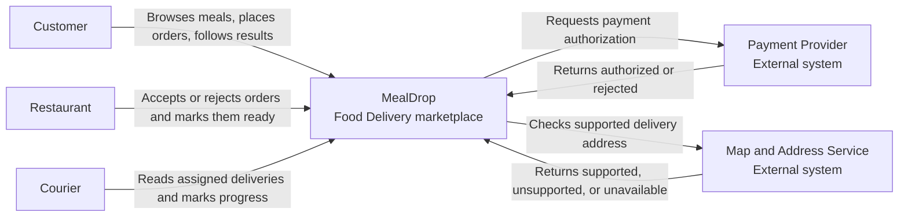
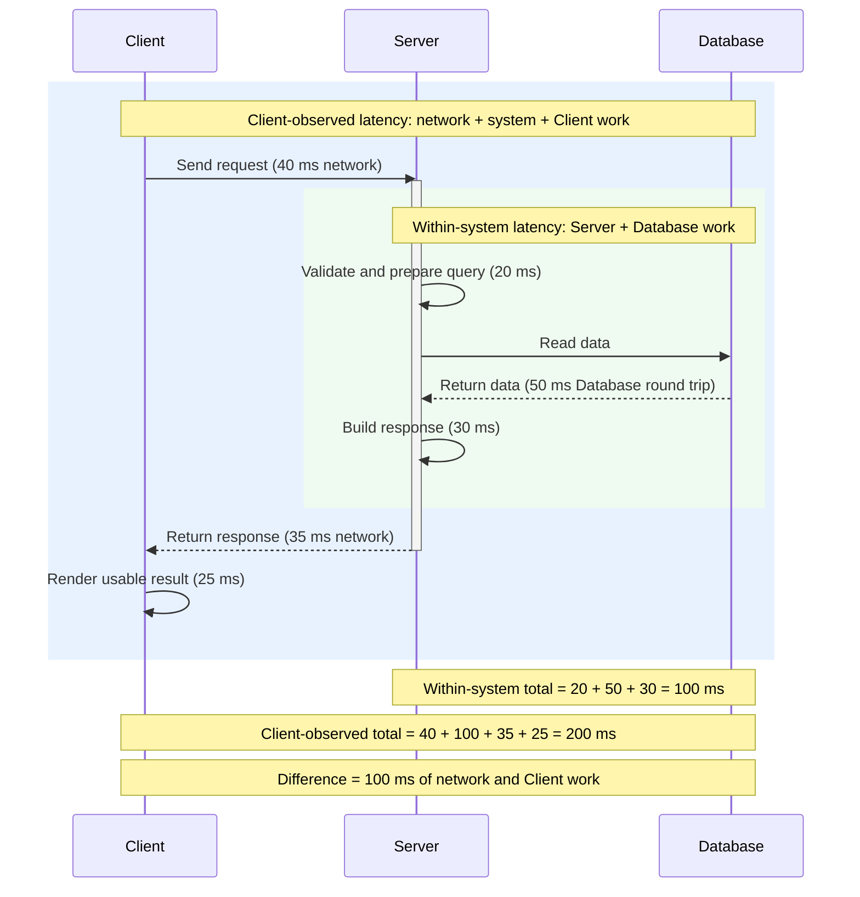
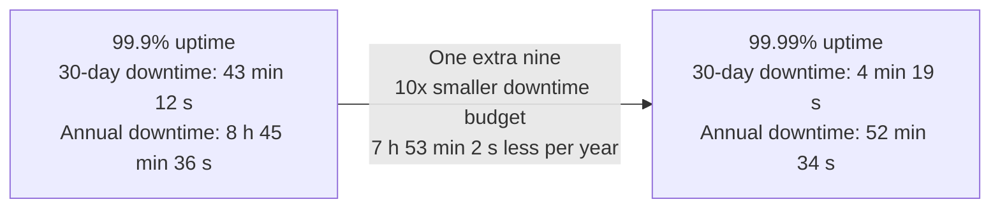

# Lecția 3: Cerințe de calitate, volum de lucru și capacitate

Acest ghid este materialul de lectură pentru acasă care însoțește Lecția 3. El
continuă exemplul MealDrop din Lecția 2 și explică modul în care faci măsurabile
afirmațiile despre calitate, descrii comportamentul la defectare și estimezi
volumul de lucru.

Această lecție creează presiune asupra proiectării. Ea nu selectează o bază de
date, un cache, o coadă, o metodă de replicare, o platformă de implementare sau
o arhitectură internă.

## Obiective de învățare

După această lecție, un Student trebuie să poată:

- să conecteze o poveste de Utilizator și un System Context view la întrebări
despre calitate;
- să scrie o cerință de calitate cu o măsură, o țintă și o condiție de
funcționare;
- să distingă latența, disponibilitatea, debitul și consistența;
- să scrie ținte de calitate diferite pentru citiri și scrieri;
- să explice defectul, eroarea, defectarea, fiabilitatea, durabilitatea și
toleranța la defecte;
- să distingă disponibilitatea bazată pe timpul de funcționare de cea bazată pe
încercări și să calculeze un buget de indisponibilitate;
- să estimeze RPS în regim stabil, RPS de vârf, stocarea, un set activ de lucru
și presiunea asupra capacității;
- să precizeze ipotezele, unitățile, rotunjirea și un rezultat de sensibilitate
la 10x;
- să folosească estimări și măsurători pentru a găsi un blocaj potențial fără să
selecteze arhitectura prea devreme.


## 1. Continuă de la Lecția 2

Lecția 2 s-a încheiat cu povești de Utilizator și un C4 System Context view.
Aceste artefacte precizează ce face produsul, cine îl folosește și de ce sisteme
externe are nevoie. Ele nu precizează cât de bine trebuie să funcționeze
produsul sau cât volum de lucru trebuie să gestioneze.

Una dintre poveștile MealDrop a fost:

```text
Ca Client, vreau să plasez o comandă la o adresă acceptată și să primesc un
rezultat clar, astfel încât să știu dacă aceasta va fi pregătită.
```

Definițiile de Făcut ale acesteia au inclus următoarele rezultate:

- arată Comanda ca acceptată numai după ce plata este autorizată și Restaurantul
o acceptă;
- arată o adresă neacceptată ca neacceptată;
- arată respingerea unei plăți sau a unui Restaurant ca respingere;
- arată un rezultat necesar care lipsește ca fiind în așteptare sau indisponibil,
nu ca succes.

System Context view-ul a arătat aceeași limită a produsului:




Povestea și view-ul lasă deschise întrebări importante:

- Cât de rapidă trebuie să fie răsfoirea Restaurantelor?
- Cât de des poate fi indisponibilă o încercare validă de Plasare a Comenzii?
- Câte operații de citire și scriere trebuie să se încheie în fiecare secundă?
- Ce poate arăta o citire a stării Comenzii după o scriere confirmată?
- Ce se întâmplă când timpul de așteptare pentru Payment Provider expiră?
- Câți Clienți, câte Restaurante, câți Curieri și câte Comenzi trebuie să
gestioneze sistemul?

Lecția 3 adaugă aceste condiții de funcționare:

```text
poveste de Utilizator și System Context
  -> țintă de calitate măsurabilă
  -> defectare importantă
  -> rezultat vizibil
  -> estimarea volumului de lucru
  -> presiune asupra proiectării
```

Revino la
[ghidul de lectură pentru acasă al Lecției 2](lecture-02-product-scope-and-system-boundaries.md)
când actorul, povestea sau limita sistemului nu este clară.

## 2. Scrie o cerință de calitate măsurabilă

O cerință de calitate precizează cât de bine trebuie să funcționeze un
comportament.

Folosește această structură:

```text
quality requirement = measure + target + operating condition
```

- Măsură: valoarea observată sau calculată.
- Țintă: limita dintre comportamentul acceptabil și cel inacceptabil.
- Condiție de funcționare: volumul de lucru, intervalul de timp sau situația în
care ținta trebuie să fie respectată.

Folosește această formă de propoziție:

```text
În <condiția de funcționare>, <măsura> trebuie să respecte <ținta>.
```

Compară aceste afirmații:


| Afirmație vagă                                    | Afirmație măsurabilă                                                                                                                                              |
| ------------------------------------------------- | ----------------------------------------------------------------------------------------------------------------------------------------------------------------- |
| Răsfoirea Restaurantelor trebuie să fie rapidă.   | La volumul de lucru țintă pentru citire, **95%** dintre **citirile listei de Restaurante** returnează rezultatul în **300 ms** de la primirea cererii.            |
| MealDrop trebuie să fie disponibil permanent.     | În intervalul măsurat al serviciului, cel puțin **99.9%** dintre **încercările de citire a listei de Restaurante** returnează rezultatul corect în **2 secunde**. |
| MealDrop trebuie să gestioneze mulți Utilizatori. | La ținta pentru perioada meselor, MealDrop finalizează **700 de citiri** și **20 de scrieri de Plasare a Comenzii pe secundă**.                                   |
| Starea Comenzii trebuie să rămână consecventă.    | După ce MealDrop **confirmă** `accepted`, următoarea **citire** a Comenzii făcută de Restaurant arată `accepted`.                                                 |


Numerele sunt ipoteze folosite ca exemple. O țintă reală are nevoie de dovezi
despre nevoile Utilizatorului, risc, măsurare și cost.

### Cerințele de citire și scriere sunt diferite

O citire returnează informații existente. O scriere validează și modifică starea
înainte să poată confirma corect succesul. Acestea pot folosi activități diferite
și se pot defecta în moduri diferite.


| Întrebare                      | Citire                                                          | Scriere                                                                    |
| ------------------------------ | --------------------------------------------------------------- | -------------------------------------------------------------------------- |
| Latența se încheie când        | apelantul primește rezultatul cerut                             | apelantul primește o confirmare corectă a modificării definite             |
| Disponibilitatea întreabă dacă | datele cerute pot fi returnate                                  | modificarea poate ajunge la un rezultat acceptat sau respins de încredere  |
| Debitul numără                 | citirile acceptabile finalizate pe secundă                      | scrierile acceptabile finalizate pe secundă                                |
| Consistența definește          | ce stare confirmată sau etichetată cu vechimea poate fi arătată | când poate fi declarat succesul și ce trebuie să arate citirile ulterioare |


Nu folosi o singură țintă pentru toate operațiile, cu excepția cazului în care
nevoia Utilizatorului și comportamentul măsurat sunt aceleași.

## 3. Cele patru calități principale


### Latență

Latența este timpul scurs între două puncte numite.




- În interiorul sistemului: primire -> trimitere; include dependențele.
- Observată de Client: trimitere -> rezultat utilizabil; include ambele segmente
de rețea și activitatea Clientului.

Exemple:

- Citire în sistem: intrarea cererii -> ieșirea răspunsului.
- Citire a Clientului: cerere trimisă -> meniu vizibil.
- Scriere a Comenzii: comandă primită -> stare stocată confirmată.


#### De ce media nu este suficientă

Aceste două grupuri au aceeași medie de 100 ms:

```text
A: 120, 100, 110, 90, 80 ms
B:  20,  50,  30, 40, 360 ms
```

Aceeași medie ascunde cererea lentă de 360 ms din grupul B.

P50 este respectat de 50 din 100 de cereri și arată rezultatul din mijloc. P95
este respectat de 95 din 100 de cereri și arată partea lentă a distribuției.
Adaugă un timp de expirare pentru restul de 5%.

#### Două exemple de citire și un exemplu de scriere

Acestea sunt exemple complete de ținte, nu fapte măsurate în producție:

1. Citirea listei de Restaurante, latență în interiorul sistemului:

```text
 La maximum 700 RPS de citire, măsurate de la primirea de către Server până când
 lista corectă de Restaurante este trimisă, latența trebuie să fie
 p50 <= 100 ms și p95 <= 300 ms.
```

1. Citirea stării Comenzii, latență observată de Client:

```text
 La maximum 700 RPS de citire, măsurate de la trimiterea de către Client până când
 starea corectă a Comenzii poate fi folosită, latența trebuie să fie
 p50 <= 200 ms și p95 <= 700 ms.
```

1. Scrierea Acceptării Comenzii, latență observată de Client:

```text
 La maximum 20 de scrieri de Acceptare a Comenzii pe secundă, măsurate de la
 trimiterea de către Client până când starea acceptată stocată este confirmată
 Restaurantului, latența trebuie să fie p50 <= 500 ms și p95 <= 1,500 ms.
```


### Disponibilitate

Disponibilitatea este o caracteristică a unui sistem care urmărește să asigure
un nivel convenit de performanță operațională, de obicei timpul de funcționare,
pentru o perioadă mai lungă decât cea normală. Două stiluri răspund la întrebări
diferite:


| Stil                           | Formulă                              | Întrebare                                                |
| ------------------------------ | ------------------------------------ | -------------------------------------------------------- |
| Bazat pe timpul de funcționare | usable time / measured time          | În ce parte a intervalului a putut fi folosit serviciul? |
| Bazat pe încercări             | acceptable attempts / valid attempts | Câte încercări reale au primit un rezultat acceptabil?   |


Această lecție se concentrează mai întâi pe disponibilitatea bazată pe timpul
de funcționare. Ținta trebuie să numească serviciul și intervalul de măsurare.
Răsfoirea Restaurantelor poate funcționa în timp ce Plasarea Comenzii este
indisponibilă, deoarece Payment Provider nu poate fi contactat.

Disponibilitatea bazată pe încercări revine mai târziu pentru intervalele cu
trafic de valoare ridicată.

#### Definește disponibilitatea bazată pe timpul de funcționare

Disponibilitatea bazată pe timpul de funcționare acordă aceeași importanță
fiecărei secunde:

```text
uptime availability = usable time / total measured time

downtime budget = total measured time x (1 - availability target)
```

O țintă completă este:

```text
În fiecare interval de 30 de zile, răsfoirea Restaurantelor poate fi folosită cel
puțin 99.9% din timpul măsurat.
```


#### Învață din pagini reale de stare

Paginile publice de stare arată de ce disponibilitatea are nevoie de un domeniu
de aplicare al serviciului:

- [GitHub Status](https://www.githubstatus.com/) raportează separat componente
precum Git Operations, API Requests, Actions, Pages și Copilot. De asemenea,
oferă timpul de funcționare pentru 90 de zile și
[istoricul incidentelor](https://www.githubstatus.com/history).
- [AWS Health Dashboard](https://health.aws.amazon.com/health/status) raportează
evenimente publice după serviciul AWS și Region.
- [SLA-ul AWS EC2](https://aws.amazon.com/compute/sla/) folosește domenii de
aplicare diferite: un timp de funcționare lunar de 99.99% pentru angajamentul
la nivel de Region în mai multe Availability Zones și 99.5% pentru o instanță
EC2.


#### Transformă procentele de disponibilitate în timp absolut

Pentru un an de 365 de zile:

```text
365 x 24 x 60 x 60 = 31,536,000 seconds/year
```


| Țintă   | Indisponibilitate în 30 de zile | Indisponibilitate în 365 de zile     |
| ------- | ------------------------------- | ------------------------------------ |
| 99%     | 7 ore și 12 minute              | 3 zile, 15 ore și 36 de minute       |
| 99.9%   | 43 de minute și 12 secunde      | 8 ore, 45 de minute și 36 de secunde |
| 99.99%  | 4 minute și 19 secunde          | 52 de minute și 34 de secunde        |
| 99.999% | aproximativ 26 de secunde       | aproximativ 5 minute și 15 secunde   |





O cifră 9 suplimentară împarte bugetul de indisponibilitate la 10. Aceasta nu
înseamnă "aproape la fel". Într-un interval de 30 de zile, o întrerupere de 12
minute respectă 99.9%, dar nu respectă 99.99%.

Bugetul poate fi consumat de o singură întrerupere sau de mai multe întreruperi.
Procentul nu descrie distribuția acestora.

#### Selectează o țintă după ROI

O țintă mai mare are valoare numai când prejudiciul evitat justifică acel cost
suplimentar.

```text
avoided loss = reduced downtime x estimated loss per minute

target ROI = (avoided loss - added cost) / added cost
```

Trecerea de la 99.9% la 99.99% reduce bugetul cu aproximativ 38 de minute și 53
de secunde în 30 de zile sau cu 7 ore, 53 de minute și 2 secunde pe an.
Respectarea acestei ținte poate necesita mai multă proiectare, testare,
monitorizare, activitate de recuperare și complexitate operațională.

Exemple:

- Un instrument intern mic pentru predare poate să nu recupereze suficientă
valoare din cifra nouă suplimentară.
- Un flux de plată sau tranzacționare poate pierde mai multă valoare în câteva
minute de indisponibilitate decât costă ținta mai mare.

Folosește dovezi despre produs. Nu selecta ținta cea mai mare din obișnuință.

#### MTBF, MTTR, SLO și SLA

Acest model aproximativ conectează timpul de funcționare la defectare și
recuperare:

```text
availability ~= MTBF / (MTBF + MTTR)
```

- MTBF este timpul mediu dintre defectări.
- MTTR este timpul mediu necesar pentru restabilirea unui serviciu utilizabil.

Un SLO precizează ținta. Un SLA adaugă reguli de măsurare, excluderi și
consecințe. Exemplul AWS EC2 este un SLA. Domeniul de aplicare exact al acestuia
este la fel de important ca procentul.

Pentru un timp de funcționare de 99.9% în 30 de zile, bugetul de eroare bazat pe
timp este de 43 de minute și 12 secunde. Bugetul nu este un obiectiv pentru a
crea indisponibilitate. El face vizibil riscul acceptat.

#### Revino la disponibilitatea bazată pe încercări pentru intervalele critice

Timpul de funcționare acordă aceeași importanță fiecărei secunde. Zece minute de
indisponibilitate la trafic redus și zece minute de indisponibilitate în timpul
celui mai aglomerat eveniment consumă același buget al timpului de funcționare.
Impactul lor asupra Utilizatorului și a afacerii poate fi foarte diferit.

Folosește disponibilitatea bazată pe încercări ca a doua măsură când concentrarea
traficului este importantă:

```text
attempt availability = acceptable attempts / all valid attempts
```

Exemple ilustrative:

- Finalizarea cumpărăturilor Amazon în timpul Black Friday: dacă apar 1,000,000
de încercări valide de finalizare a cumpărăturilor, o țintă bazată pe încercări
de 99.99% permite cel mult 100 de încercări inacceptabile.
- Un produs financiar în timpul orelor de tranzacționare: dacă apar 1,000,000 de
citiri valide ale prețurilor, o țintă bazată pe încercări de 99.9% permite cel
mult 1,000 de citiri inacceptabile.

Raportează separat disponibilitatea bazată pe timpul de funcționare și cea bazată
pe încercări. Una nu o poate înlocui pe cealaltă.

### Debit

Debitul este numărul de operații acceptabile finalizate într-un interval de timp
precizat, în timp ce celelalte ținte de calitate continuă să fie respectate.

```text
read throughput = acceptable completed reads / second
write throughput = acceptable completed writes / second
```

Pornirea a 500 de operații nu dovedește 500 RPS. Dacă numai 300 se finalizează
în limitele de calitate, debitul acceptabil măsurat este de 300 de operații pe
secundă.

Capacitatea de citire și cea de scriere nu sunt interschimbabile. Un test la 300
RPS de citire nu dovedește că sistemul poate gestiona 300 RPS de scriere.

#### Exemple de ținte MealDrop

1. Citirile Restaurantelor și ale stării Comenzii:

```text
 În timpul vârfului din perioada meselor, MealDrop finalizează cel puțin 700 de
 citiri acceptabile ale Restaurantelor, meniurilor și stării Comenzilor pe
 secundă, în timp ce țintele lor de latență, disponibilitate și consistență
 continuă să fie respectate.
```

Un rezultat greșit, vechi, indisponibil sau întârziat nu este o citire
acceptabilă finalizată pentru această țintă.

1. Scrierile de Plasare a Comenzii:

```text
 În timpul vârfului din perioada meselor, MealDrop finalizează cel puțin 20 de
 scrieri valide de Plasare a Comenzii pe secundă, în timp ce țintele de latență
 și disponibilitate ale scrierilor continuă să fie respectate.
```

Numără o scriere numai când ajunge la un rezultat acceptat de încredere sau la
un rezultat respins pe baza regulilor. Nu număra o scriere pornită sau un timp
de expirare ambiguu.

#### Exercițiu scurt despre debit

Calculează separat debitul de citire și cel de scriere:

```text
600 de Clienți sunt activi.
50% citesc o listă de Restaurante o dată la 10 secunde.
10% plasează o Comandă într-un minut.
```

Încearcă să faci calculul înainte să verifici rezultatul:

```text
reads = 600 x 0.50 / 10 = 30 read RPS
writes = 600 x 0.10 / 60 = 1 write RPS
```

Dovedește `30 read RPS` că MealDrop poate gestiona `30 write RPS`? Nu. Citirile
și scrierile fac activități diferite, deci au nevoie de teste de încărcare
separate.

#### Verifică debitul cu un test de încărcare

Un test de încărcare trimite trafic controlat către un mediu de testare. Acesta
verifică dacă țintele de debit, latență și disponibilitate continuă să fie
respectate împreună. El nu dovedește capacitatea de producție, cu excepția
cazului în care mediul și volumul de lucru sunt reprezentative.

[Grafana k6](https://grafana.com/docs/k6/latest/) poate modela o rată fixă de
sosire a cererilor. Componenta sa
[constant-arrival-rate executor](https://grafana.com/docs/k6/latest/using-k6/scenarios/executors/constant-arrival-rate/)
pornește iterații independent de timpul de răspuns. Dacă o iterație trimite o
cerere, `700 iterations/s` modelează `700 RPS`.

### Consistență

Consistența este o proprietate de corectitudine aplicată unui istoric de operații
de citire și scriere. Ea limitează rezultatul pe care îl poate returna o citire
pe baza scrierilor finalizate și a ordinii acestora.

Aici, un istoric este o înregistrare ordonată a pornirii operațiilor și a
rezultatelor vizibile.

O cerință de consistență trebuie să definească:

- rezultatul scrierii care activează regula;
- citirea sau citirile ulterioare pe care le acoperă regula;
- valorile pe care le pot returna aceste citiri;
- dacă este permisă o valoare mai veche și modul în care aceasta trebuie
etichetată;
- când sistemul trebuie să returneze indisponibil în locul unei valori
nevalide.

Consistența nu înseamnă că fiecare copie a datelor este identică în fiecare
moment. Ea definește rezultatele vizibile în produs care sunt permise. Regula
creează presiune asupra proiectării, dar nu selectează o bază de date.

#### Modele uzuale de consistență


| Model                       | Garanție                                                                                                                                                                      | Exemplu MealDrop                                                                                               |
| --------------------------- | ----------------------------------------------------------------------------------------------------------------------------------------------------------------------------- | -------------------------------------------------------------------------------------------------------------- |
| Puternică sau liniarizabilă | Fiecare operație pare să aibă efect într-un punct dintre începutul și sfârșitul său. O citire care începe după finalizarea unei scrieri vede acea scriere sau una ulterioară. | După ce `accepted` este confirmat, nicio citire ulterioară a Comenzii nu poate arăta `pending`.                |
| Vechime limitată            | O citire poate returna o valoare mai veche, dar numai într-o limită de timp sau de versiune precizată.                                                                        | O citire a Comenzii poate folosi o valoare din cache timp de cel mult 3 secunde după acceptare.                |
| Consistență eventuală       | Dacă scrierile se opresc, toate copiile ajung în cele din urmă la aceeași stare. Cuvântul "eventual" nu impune un timp fix pentru aceasta.                                    | Statisticile Restaurantului pot fi temporar diferite, apoi ajung la aceeași stare după oprirea actualizărilor. |
| Citirea propriilor scrieri  | Citirile ulterioare ale unui Utilizator includ scrierile finalizate de acel Utilizator.                                                                                       | Un Restaurant care acceptă o Comandă vede `accepted` în citirile sale ulterioare din sesiune.                  |
| Consistență cauzală         | Operațiile care se pot cauza reciproc sunt observate în ordinea cauză-efect.                                                                                                  | Un Client nu vede notificarea de acceptare înainte de acceptarea Restaurantului care a cauzat-o.               |


O garanție mai puternică nu este automat mai bună. Garanțiile mai puternice pot
adăuga latență, pot reduce disponibilitatea în timpul anumitor defecte sau pot
necesita mai multă coordonare. Selectează cel mai mic model care protejează
regula produsului.

```text
După ce MealDrop confirmă că un Restaurant a acceptat o Comandă, citirile
Comenzii făcute de Restaurant pot returna ultima valoare `pending` confirmată
timp de cel mult 3 secunde.

După 3 secunde, o citire a Comenzii arată `accepted`, o stare confirmată
ulterioară sau un rezultat explicit indisponibil. Ea nu afirmă că `pending`
este starea curentă.

După ce orice citire arată `accepted`, citirile ulterioare nu returnează
`pending`.
```


#### Exercițiu scurt despre consistență

Folosește regula de mai sus pentru a evalua aceste cazuri:

1. La o secundă după confirmare, o citire arată valoarea mai veche `pending` și
  o etichetează ca fiind mai veche decât acceptarea.
2. La două secunde după confirmare, o citire arată `accepted`.
3. La patru secunde după confirmare, o citire arată `pending` ca stare curentă.
4. O citire arată `accepted`; o citire ulterioară arată `pending`.

Care caz încalcă regula?

Cazurile 3 și 4 o încalcă. Cazul 3 depășește limita de vechime de 3 secunde.
Cazul 4 încalcă garanția de citire monotonă. Cazurile 1 și 2 respectă regula.

Actualitatea este o posibilă regulă de consistență pentru o citire. Ea poate
defini:

- vechimea maximă a datelor returnate;
- dacă sunt acceptabile datele vechi etichetate cu vechimea lor;
- cât de repede trebuie să devină vizibilă o modificare confirmată;
- când sistemul trebuie să returneze indisponibil în locul unui rezultat vechi.

Unele citiri ale prețurilor de piață pot permite date vechi etichetate cu
vechimea lor. O actualizare a Comenzii nu trebuie să confirme două rezultate
curente care sunt în conflict. Operația determină regula.

## 4. Descrie precis defectările

Folosește acest lanț:

```text
defect -> stare internă incorectă -> defectare vizibilă
```

- Defect: o cauză care poate crea o problemă.
- Eroare: o stare internă incorectă cauzată de un defect.
- Defectare: un comportament vizibil care nu respectă specificația.

Exemplu MealDrop:

1. Defect: timpul de așteptare pentru răspunsul Payment Provider expiră.
2. Eroare: MealDrop marchează plata ca acceptată fără dovezi.
3. Defectare: Clientul vede o Comandă confirmată care nu respectă regula de
  plată.

Un defect nu creează întotdeauna o defectare. Dacă MealDrop returnează
`Payment result unavailable; try again` conform specificației, timpul de
așteptare a expirat, dar comportamentul vizibil poate continua să respecte
cerința.

### Alte calități


| Calitate             | Sens simplu                                                                 | Exemplu MealDrop                                                                |
| -------------------- | --------------------------------------------------------------------------- | ------------------------------------------------------------------------------- |
| Fiabilitate          | Serviciul corect continuă în timpul precizat                                | Acceptarea Restaurantului funcționează corect în intervalul meselor             |
| Durabilitate         | Datele confirmate supraviețuiesc defectării precizate                       | O Comandă confirmată continuă să existe după repornirea unui proces             |
| Toleranță la defecte | Un serviciu numit continuă în ciuda unui defect numit                       | Răsfoirea Restaurantelor continuă după oprirea unui proces care servește citiri |
| Cost / eficiență     | Resursele și banii folosiți pentru a respecta țintele de calitate selectate | Măsoară costul de calcul, rețea, stocare și furnizor împreună cu țintele        |


Toleranța la defecte nu înseamnă "supraviețuiește oricărui lucru". Numește
serviciul și defectul.

Pentru cost / eficiență, selectează cea mai mică țintă justificată care respectă
nevoia produsului și riscul. Latența mai mică, disponibilitatea mai mare,
debitul mai mare și consistența mai puternică pot necesita mai multe resurse,
mai multă activitate de proiectare și o complexitate operațională mai mare.

## 5. Estimează volumul de lucru și presiunea asupra capacității

O estimare este un model, nu o prognoză. Valoarea ei provine din intrările
explicite și din decizia pe care o poate susține.

Formula de bază:

```text
RPS = actors x participating share x actions per actor / seconds
```

În această lecție, QPS și RPS înseamnă cereri pe secundă. Folosește RPS pentru
consecvență.

### Ipoteze MealDrop

Următoarele valori sunt ipoteze folosite ca exemple, nu fapte din producție:

- 3,000 de Clienți concurenți;
- 300 de Restaurante active;
- 500 de Curieri activi;
- fiecare acțiune enumerată creează o cerere MealDrop;
- fluxurile pot avea loc în același timp;
- procentele sunt ponderi medii în intervalul selectat;
- reîncercările, activitatea din fundal, apelurile către furnizori externi și
octeții răspunsurilor sunt excluse;
- rotunjirea are loc numai când este necesară o țintă exprimată în cereri sau
servere întregi.

Utilizatorii lunari și Utilizatorii concurenți sunt intrări diferite.
Utilizatorii concurenți acționează în același interval al volumului de lucru.

### RPS în regim stabil


| Operație                          | Actori          | Participare | Frecvență      | Calcul                       | RPS       |
| --------------------------------- | --------------- | ----------- | -------------- | ---------------------------- | --------- |
| Răsfoirea Restaurantelor          | 3,000 Clienți   | 60%         | o dată la 15 s | `3,000 x 0.60 / 15`          | 120       |
| Vizualizarea meniului             | 3,000 Clienți   | 50%         | o dată la 20 s | `3,000 x 0.50 / 20`          | 75        |
| Citirea stării Comenzii           | 3,000 Clienți   | 20%         | o dată la 5 s  | `3,000 x 0.20 / 5`           | 120       |
| Citirea Comenzilor Restaurantului | 300 Restaurante | 50%         | o dată la 4 s  | `300 x 0.50 / 4`             | 37.5      |
| Citirea alocării Curierului       | 500 Curieri     | 60%         | o dată la 10 s | `500 x 0.60 / 10`            | 30        |
| **Total**                         |                 |             |                | `120 + 75 + 120 + 37.5 + 30` | **382.5** |


Rotunjește numai ținta pentru capacitate:

```text
382.5 RPS -> 383 RPS
```

Răsfoirea și citirile stării Comenzii creează 240 din 382.5 RPS, adică
aproximativ 63% din traficul stabil modelat. Acestea sunt primele fluxuri care
trebuie investigate. Acest rezultat nu dovedește că unul dintre fluxuri este un
blocaj.

### RPS de vârf

Un vârf are nevoie de un comportament definit pentru un interval scurt. Nu
folosi "volum stabil x 2" fără dovezi.


| Operație                          | Actori          | Participare la vârf | Frecvență la vârf | RPS de vârf |
| --------------------------------- | --------------- | ------------------- | ----------------- | ----------- |
| Răsfoirea Restaurantelor          | 3,000 Clienți   | 78%                 | o dată la 10 s    | 234         |
| Vizualizarea meniului             | 3,000 Clienți   | 50%                 | o dată la 10 s    | 150         |
| Citirea stării Comenzii           | 3,000 Clienți   | 25%                 | o dată la 5 s     | 150         |
| Citirea Comenzilor Restaurantului | 300 Restaurante | 75%                 | o dată la 4 s     | 56.25       |
| Citirea alocării Curierului       | 500 Curieri     | 49%                 | o dată la 5 s     | 49          |
| **Subtotal de vârf**              |                 |                     |                   | **639.25**  |


Adaugă o marjă de capacitate de 10% după subtotal:

```text
639.25 x 1.10 = 703.175 RPS
703.175 RPS -> 704 RPS peak target
```

Marja creează spațiu peste această estimare. Ea nu corectează operațiile lipsă,
ipotezele slabe sau un interval de vârf nevalid.

### Stocare

Presupune un milion de înregistrări noi de Comenzi în fiecare zi și o dimensiune
medie stocată de 1,100 de octeți pentru fiecare Comandă:

```text
1,000,000 Orders/day x 1,100 bytes/Order = 1,100,000,000 bytes/day

1,100,000,000 / 1,073,741,824 ~= 1.024 GiB/day -> about 1.03 GiB/day

1.03 GiB/day x 365 days ~= 376 GiB/year
```

Această estimare exclude indexurile, replicile, jurnalele, copiile de siguranță,
fișierele media, copiile temporare și regulile de păstrare. Ea nu este un plan
de cumpărare a stocării.

### Setul activ de lucru

Presupune 100,000 de rezumate ale Comenzilor active sau vizualizate recent, cu
câte 820 de octeți fiecare:

```text
100,000 x 820 bytes = 82,000,000 bytes

82,000,000 / 1,048,576 ~= 78.2 MiB -> about 78 MiB
```

Stocarea totală include datele păstrate. Setul activ de lucru este submulțimea
folosită frecvent în intervalul selectat. Estimarea setului activ creează o
întrebare ulterioară despre accesul la date. Ea nu dovedește că este necesar un
cache.

### Capacitate din dovezi măsurate

Presupune că un test de încărcare arată că o instanță de serviciu gestionează în
siguranță 250 RPS și respectă ținta de latență:

```text
704 target RPS / 250 measured RPS per instance
  = 2.816
  -> 3 active units of measured capacity
```

Trei instanțe nu păstrează o capacitate de 704 RPS după oprirea uneia:

```text
(3 - 1) x 250 = 500 RPS
500 RPS < 704 RPS
```

Patru instanțe păstrează trei unități de capacitate după oprirea uneia:

```text
(4 - 1) x 250 = 750 RPS
750 RPS >= 704 RPS
```

Concluzia este condiționată:

```text
Estimarea creează presiune pentru 3 unități active de capacitate măsurată sau 4
unități dacă cerința precizează că acea capacitate de vârf trebuie să
supraviețuiască pierderii unei instanțe.
```

Testul de încărcare și cerința de defectare sunt dovezi. Numai împărțirea nu
este un plan de implementare.

### Sensibilitate la 10x

Mărește numărul actorilor de 10 ori și păstrează neschimbate celelalte ipoteze:

```text
steady: 382.5 x 10 = 3,825 RPS

peak subtotal: 639.25 x 10 = 6,392.5 RPS
peak target: 6,392.5 x 1.10 = 7,031.75 -> 7,032 RPS
```

Acest test arată cum reacționează modelul la modificarea unei intrări. El nu
dovedește că comportamentul Utilizatorului, distribuția datelor, limitele
externe sau capacitatea instanței rămân constante la o scară de 10x.

## 6. Găsește blocajul potențial

Un blocaj potențial nu este întotdeauna fluxul cu cele mai multe cereri. Caută
trei tipuri de presiune:

- un flux folosit suficient de des pentru a domina latența sau debitul;
- o dependență externă care poate opri o operație importantă a Utilizatorului;
- un flux de stare în care mai multe citiri și scrieri pot arăta rezultate care
sunt în conflict.

Folosește estimările volumului de lucru, System Context view-ul și cerințele de
calitate pentru a decide unde să investighezi mai întâi. Rezultatul este o
ipoteză, nu o cauză dovedită.

### Puncte de presiune MealDrop


| Calitate        | Punct de presiune potențial              | De ce poate cauza probleme                                                                                                                                                   |
| --------------- | ---------------------------------------- | ---------------------------------------------------------------------------------------------------------------------------------------------------------------------------- |
| Latență         | Răsfoirea Restaurantelor și a meniurilor | Clienții folosesc frecvent aceste fluxuri de citire. Accesul repetat la date sau apelurile către dependențe pot face ca latența lor p95 să domine experiența Utilizatorului. |
| Disponibilitate | Payment Provider                         | Plasarea Comenzii are nevoie de un rezultat al plății. O dependență externă cu volum mai mic poate face indisponibil întregul flux de scriere.                               |
| Consistență     | Starea Comenzii                          | Clienții, Restaurantele și Curierii citesc sau modifică starea asociată a Comenzii. Actualizările întârziate pot arăta stări vechi sau care sunt în conflict.                |


Acești candidați duc la întrebări diferite:

1. **Răsfoirea Restaurantelor și a meniurilor**
  - Care citire este folosită cel mai mult?
  - Ce activitate se repetă pentru mulți Clienți?
  - Poate următoarea proiectare să servească acest flux fără să repete toată
  activitatea?
2. **Payment Provider**
  - Ce returnează Plasarea Comenzii când plata este lentă sau indisponibilă?
  - Ce funcționalități MealDrop pot rămâne disponibile?
  - Cum evită proiectarea confirmarea unei Comenzi fără un rezultat de plată
  de încredere?
3. **Starea Comenzii**
  - Ce operații pot modifica starea?
  - Ce tranziții sunt valide?
  - Cât de repede trebuie să vadă fiecare actor o modificare confirmată?
  - Când este permisă o valoare mai veche etichetată și când trebuie să
  returneze citirea indisponibil?


### Pregătește-te pentru lecția următoare

Lecția următoare transformă aceste puncte de presiune în cea mai mică
arhitectură internă. Analizează dacă proiectarea trebuie:

- să separe citirile aglomerate de scrierile critice;
- să refolosească rezultate sigure pentru Restaurante și meniuri;
- să izoleze defectarea Payment Provider de răsfoire;
- să ofere modificărilor stării Comenzii un singur flux definit clar;
- să permită fiecărei părți să se scaleze sau să se recupereze conform propriei
ținte de calitate.

Nu selecta o bază de date, un cache, o coadă, o metodă de replicare sau o
topologie de implementare numai pe baza unei estimări. Conectează mai întâi
mecanismul posibil la o problemă de calitate specifică.

Folosește această formă pentru concluzie:

```text
<Fluxul sau dependența> este un punct de presiune potențial pentru <calitate>,
din cauza <dovezilor despre volumul de lucru, defectare sau stare>. Următoarea
proiectare trebuie să ofere <capabilitatea>. Mai avem nevoie de <dovezile lipsă>
înainte să selectăm un mecanism.
```


## 7. Exemplul Dashboard din lecție

Lecția a aplicat metoda numai pentru trei citiri Dashboard la 1,000 de
Utilizatori concurenți. Laboratorul 2 folosește toate cele șase citiri și
intervale de scară diferite.


| Citire      | Comportament                                | Calcul              | RPS în regim stabil |
| ----------- | ------------------------------------------- | ------------------- | ------------------- |
| Overview    | 70% reîmprospătează o dată la 30 de secunde | `1,000 x 0.70 / 30` | 23.33               |
| Stock price | 20% cer o dată pe secundă                   | `1,000 x 0.20`      | 200                 |
| Watchlist   | 60% reîmprospătează o dată pe minut         | `1,000 x 0.60 / 60` | 10                  |
| **Total**   |                                             | `23.33 + 200 + 10`  | **233.33 -> 234**   |


La deschiderea pieței:

```text
Overview peak = 1,000 x 0.30 / 10 = 30 RPS

Watchlist peak = 1,000 x 0.30 x 0.60 / 10 = 18 RPS

market-open target
  = (233.33 + 30 + 18) x 1.10
  = 309.467
  -> 310 RPS
```

Citirile Stock price creează aproximativ 86% din acest model stabil parțial.
Acest rezultat susține testarea mai întâi a fluxului respectiv. El nu dovedește
că fluxul este un blocaj măsurat sau că o cerere Browser creează o cerere către
furnizor.

O posibilă regulă de consistență pentru prețul pieței este:

```text
Returnează ultimul preț de piață acceptat împreună cu ora furnizorului și o
etichetă de întârziere, cât timp se află în limita maximă de vechime selectată.
Returnează indisponibil când nu există un preț acceptat sau când vechimea
depășește limita. Nu arăta zero și nu afirma că un preț vechi este curent.
```


## 8. Greșeli frecvente


| Greșeală                                                | Corecție                                                                |
| ------------------------------------------------------- | ----------------------------------------------------------------------- |
| Folosești media ca singura țintă de latență             | Folosește o percentilă și definește limita părții lente a distribuției  |
| Numeri fiecare HTTP 200 ca disponibil                   | Numără numai rezultatul acceptabil din interiorul limitei               |
| Tratezi cererile pornite ca debit                       | Numără operațiile acceptabile finalizate                                |
| Aplici o singură țintă fiecărei citiri și scrieri       | Definește ținte pentru fiecare operație importantă                      |
| Folosești Utilizatorii lunari ca Utilizatori concurenți | Precizează câți Utilizatori acționează în același interval              |
| Rotunjești fiecare rând înainte de adunare              | Păstrează precizia utilă și rotunjește la pasul țintei                  |
| Definești un vârf ca multiplu fix                       | Precizează comportamentul Utilizatorului într-un interval scurt de vârf |
| Tratezi cel mai mare rând ca blocaj dovedit             | Folosește-l ca prima ipoteză de măsurare                                |
| Tratezi sensibilitatea la 10x ca prognoză               | Precizează intrarea modificată și ipotezele care au rămas fixe          |
| Selectezi o componentă pe baza unei estimări            | Precizează presiunea și dovezile care încă lipsesc                      |


## 9. Termeni principali


| Termen                                          | Sens                                                                                                   |
| ----------------------------------------------- | ------------------------------------------------------------------------------------------------------ |
| Cerință de calitate                             | Măsură, țintă și condiție de funcționare pentru cât de bine trebuie să funcționeze un comportament     |
| Latență                                         | Timpul de la un început definit până la un rezultat definit                                            |
| Percentilă                                      | Limita respectată de o proporție precizată a rezultatelor măsurate                                     |
| Disponibilitate bazată pe timpul de funcționare | Proporția din timpul măsurat în care serviciul numit poate fi folosit                                  |
| Disponibilitate bazată pe încercări             | Proporția încercărilor valide care returnează un rezultat acceptabil                                   |
| Debit                                           | Operații acceptabile finalizate pe unitate de timp                                                     |
| Consistență                                     | Regula pentru ce pot arăta citirile înainte și după scrieri                                            |
| Actualitate                                     | Regula pentru vechimea permisă a datelor returnate sau momentul când o modificare devine vizibilă      |
| Cost / eficiență                                | Resursele și banii folosiți pentru respectarea țintelor selectate                                      |
| Defect                                          | Cauza unei posibile probleme                                                                           |
| Eroare                                          | Stare internă incorectă ce poate duce la o defectare                                                   |
| Defectare                                       | Comportament vizibil care nu respectă specificația                                                     |
| Fiabilitate                                     | Capacitatea de a continua serviciul corect într-un timp precizat                                       |
| Durabilitate                                    | Capacitatea datelor confirmate de a supraviețui unei defectări precizate                               |
| Toleranță la defecte                            | Capacitatea de a continua un serviciu numit în ciuda unui defect numit                                 |
| RPS                                             | Cereri pe secundă                                                                                      |
| Volum de vârf                                   | Cel mai mare volum de lucru util dintr-un interval scurt pe care trebuie să îl gestioneze proiectarea  |
| Marjă de capacitate                             | Capacitate țintă suplimentară peste estimare                                                           |
| Set activ de lucru                              | Date folosite suficient de des încât dimensiunea lor activă să poată influența o proiectare ulterioară |
| Blocaj                                          | Prima resursă, dependență sau etapă care limitează performanța acceptabilă                             |
| SLI                                             | Măsură cantitativă a comportamentului serviciului                                                      |
| SLO                                             | Valoare sau interval țintă pentru un SLI                                                               |
| SLA                                             | Acord care poate include obiective, reguli de măsurare și consecințe                                   |
| Buget de eroare                                 | Timpul sau încercările permise în afara SLO                                                            |


## 10. Surse și studiu suplimentar

Aceste surse explică vocabularul și estimarea. Ele nu selectează un cache, o bază
de date sau o implementare pentru Laboratorul 2.

### Lectură principală

- [Bass, Clements, and Kazman, *Software Architecture in Practice](https://www.pearson.com/en-us/subject-catalog/p/software-architecture-in-practice/P200000000111)*
  - secțiunea 3.3 explică scenariile atributelor de calitate printr-o sursă, un
  stimul, un mediu, un artefact, un răspuns și o măsură a răspunsului;
- *Designing Data-Intensive Applications*
  - folosește [prima ediție, Capitolul 1](https://www.oreilly.com/library/view/designing-data-intensive-applications/9781491903063/ch01.html)
  sau [a doua ediție, Capitolul 2](https://www.oreilly.com/library/view/designing-data-intensive-applications/9781098119058/ch02.html)
  pentru fiabilitate, parametrii volumului de lucru, percentilele latenței,
  scalabilitate și mentenabilitate;
- [Alex Xu, Back-of-the-envelope Estimation](https://bytebytego.com/courses/system-design-interview/back-of-the-envelope-estimation)
  - oferă exerciții în stilul interviurilor cu QPS, stocare, disponibilitate,
  scara latenței, ipoteze explicite și unități;
- [Google SRE Book: Service Level Objectives](https://sre.google/sre-book/service-level-objectives/)
  - explică SLI, SLO, SLA, disponibilitatea, debitul, percentilele latenței,
  intervalele de măsurare și bugetele de eroare;
- [Google SRE Book: Embracing Risk](https://sre.google/sre-book/embracing-risk/)
  - explică de ce 100% nu este o țintă utilă, de ce o țintă cu încă o cifră 9
  costă mai mult și de ce disponibilitatea bazată pe timp și cea bazată pe
  cereri răspund la întrebări diferite.


### Extensie opțională

- [Google SRE Workbook: Implementing SLOs](https://sre.google/workbook/implementing-slos/)
  - conectează SLI și SLO la parcursurile Utilizatorului și la rezultatele
  vizibile pentru Utilizator;
- [Google SRE Workbook: Example Error Budget Policy](https://sre.google/workbook/error-budget-policy/)
  - arată cum un obiectiv de 99.9% oferă un buget de eroare de 1,000 de erori
  pentru un milion de cereri.


### Referințe formale

- [Avizienis et al., Basic Concepts and Taxonomy of Dependable and Secure Computing](https://drum.lib.umd.edu/items/6b297ffc-373b-404f-be3a-70cc849e21fd)
  - definește vocabularul fiabilității și relația dintre defecte, erori,
  defectări, fiabilitate, disponibilitate și toleranță la defecte;
- [NIST: Definitions of the SI Units - Binary Prefixes](https://physics.nist.gov/cuu/Units/binary.html)
  - definește `KiB`, `MiB` și `GiB` și le distinge de valorile zecimale `kB`,
  `MB` și `GB`.


### Exemple reale

- [GitHub Status](https://www.githubstatus.com/) și
[istoricul incidentelor GitHub](https://www.githubstatus.com/history)
  - arată starea publică și incidentele componentelor GitHub numite;
- [AWS Health Dashboard](https://health.aws.amazon.com/health/status) și
[documentația AWS Health Dashboard](https://docs.aws.amazon.com/health/latest/ug/aws-health-dashboard-status.html)
  - arată evenimentele publice ale serviciilor AWS după serviciu, Region și dată;
- [AWS EC2 Service Level Agreement](https://aws.amazon.com/compute/sla/)
  - arată angajamente diferite privind timpul de funcționare pentru un Region și
  pentru o instanță EC2.

Sursele din linkuri includ mai multe detalii formale decât sunt necesare pentru
acest curs. Folosește definițiile simplificate și exemplele specifice
operațiilor din acest ghid pentru laborator. Materialul pentru interviuri arată
estimarea sub presiunea timpului. El nu înlocuiește structura cursului pentru
cerințele de calitate.

## Acțiunea următoare

Finalizează
[Laboratorul 2: Cuantifică citirile Dashboard](../labs/02-quality-and-estimates/README.md).
Folosește aceeași metodă cu toate cele șase citiri Dashboard. Arată ipotezele,
unitățile și calculele. Nu selecta încă arhitectura.