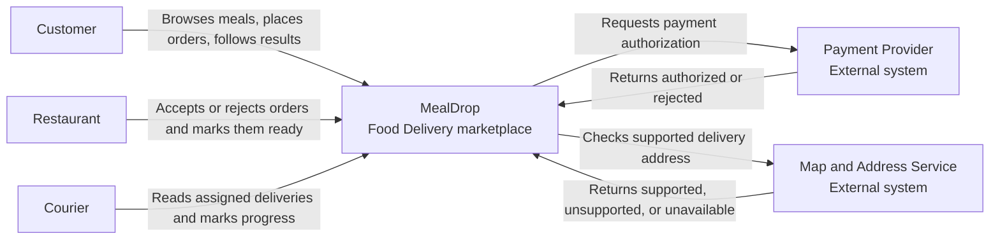
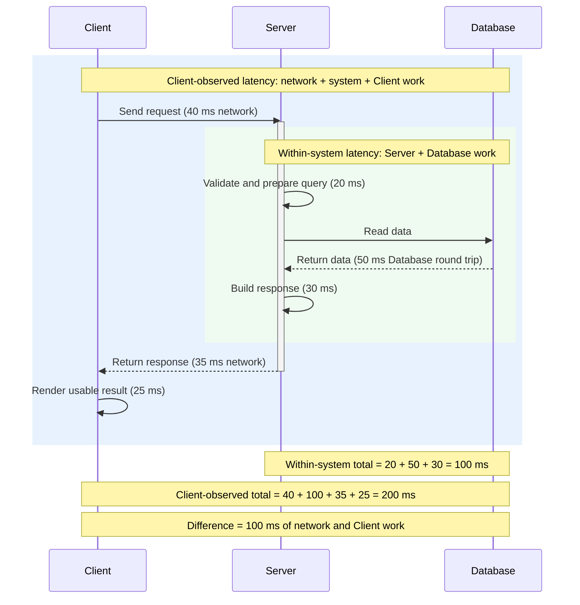
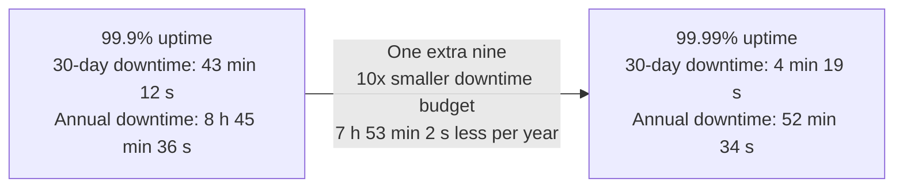

# Lecture 3: Quality Requirements, Workload, and Capacity

This guide is the home-reading companion for Lecture 3. It continues the
MealDrop example from Lecture 2 and explains how to make quality claims
measurable, describe failure behavior, and estimate workload.

This lecture creates design pressure. It does not select a database, cache,
queue, replication method, deployment platform, or internal architecture.

## Learning goals

After this lecture, a student should be able to:

- connect a user story and a System Context view to quality questions;
- write a quality requirement with a measure, target, and operating condition;
- distinguish latency, availability, throughput, and consistency;
- write different quality targets for reads and writes;
- explain fault, error, failure, reliability, durability, and fault tolerance;
- distinguish uptime-style and attempt-style availability and calculate a
downtime budget;
- estimate steady RPS, peak RPS, storage, a hot working set, and capacity
pressure;
- state assumptions, units, rounding, and one 10x sensitivity result;
- use estimates and measurements to find a potential bottleneck without
selecting architecture too early.


## 1. Continue from Lecture 2

Lecture 2 ended with user stories and a C4 System Context view. These artifacts
state what the product does, who uses it, and which external systems it needs.
They do not state how well the product must work or how much work it must
handle.

One MealDrop story was:

```text
As a Customer, I want to place an order to a supported address and receive a
clear result so that I know whether it will be prepared.
```

Its definitions of done included these results:

- show the Order as accepted only after payment is authorized and the
Restaurant accepts it;
- show an unsupported address as unsupported;
- show a payment or Restaurant rejection as rejected;
- show a missing required result as pending or unavailable, not as success.

The System Context view showed the same product boundary:




The story and view leave important questions open:

- How fast must Restaurant browsing be?
- How often may a valid Place Order attempt be unavailable?
- How many read and write operations must complete each second?
- What may an Order-status read show after a confirmed write?
- What happens when the Payment Provider times out?
- How many Customers, Restaurants, Couriers, and Orders must the system handle?

Lecture 3 adds these operating conditions:

```text
user story and System Context
  -> measurable quality target
  -> important failure
  -> visible result
  -> workload estimate
  -> design pressure
```

Return to the
[Lecture 2 home-reading guide](lecture-02-product-scope-and-system-boundaries.md)
when the actor, story, or system boundary is unclear.

## 2. Write a measurable quality requirement

A quality requirement states how well a behavior must work.

Use this structure:

```text
quality requirement = measure + target + operating condition
```

- Measure: the value that is observed or calculated.
- Target: the boundary between acceptable and unacceptable behavior.
- Operating condition: the workload, time window, or situation in which the
target must hold.

Use this sentence form:

```text
Under <operating condition>, <measure> must meet <target>.
```

Compare these statements:


| Vague claim                        | Measurable claim                                                                                                                       |
| ---------------------------------- | -------------------------------------------------------------------------------------------------------------------------------------- |
| Restaurant browsing must be fast.  | At the target read workload, **95%** of **Restaurant-list reads** return the result within **300 ms** from request receipt.            |
| MealDrop must always be available. | During the measured service window, at least **99.9%** of **Restaurant-list attempts** return the correct result within **2 seconds**. |
| MealDrop must handle many Users.   | At the meal-time target, MealDrop completes **700 reads** and **20 Place Order** **writes per second**.                                |
| Order status must stay consistent. | After MealDrop **confirms** `accepted`, the Restaurant's next Order **read** shows `accepted`.                                         |


The numbers are example assumptions. A real target needs evidence from User
needs, risk, measurement, and cost.

### Read and write requirements are different

A read returns existing information. A write validates and changes state
before it can truthfully confirm success. They can use different work and fail
in different ways.


| Question                  | Read                                              | Write                                                             |
| ------------------------- | ------------------------------------------------- | ----------------------------------------------------------------- |
| Latency ends when         | the caller receives the requested result          | the caller receives a truthful confirmation of the defined change |
| Availability asks whether | the requested data can be returned                | the change can reach a trustworthy accepted or rejected result    |
| Throughput counts         | completed acceptable reads per second             | completed acceptable writes per second                            |
| Consistency defines       | which confirmed or age-labeled state can be shown | when success can be claimed and what later reads must show        |


Do not use one target for all operations unless their User need and measured
behavior are the same.

## 3. The four core qualities


### Latency

Latency is elapsed time between two named points.




- Within-system: receipt -> send; includes dependencies.
- Client-observed: send -> usable result; includes both network legs and client
work.

Examples:

- System read: request in -> response out.
- Client read: request sent -> menu visible.
- Order write: command received -> stored state confirmed.


#### Why the average is not enough

These two groups have the same 100 ms average:

```text
A: 120, 100, 110, 90, 80 ms
B:  20,  50,  30, 40, 360 ms
```

The same average hides group B's 360 ms slow request.

P50 is met by 50 of 100 requests and shows the middle result. P95 is met by 95
of 100 requests and shows the slow tail. Add a timeout for the remaining 5%.

#### Two read examples and one write example

These are complete example targets, not measured production facts:

1. Restaurant-list read, within-system latency:

```text
 At up to 700 read RPS, measured from Server receipt until the correct
 Restaurant list is sent, latency must be p50 <= 100 ms and p95 <= 300 ms.
```

1. Order-status read, client-observed latency:

```text
 At up to 700 read RPS, measured from Client send until the correct Order
 status is usable, latency must be p50 <= 200 ms and p95 <= 700 ms.
```

1. Accept Order write, client-observed latency:

```text
 At up to 20 Accept Order writes per second, measured from Client send until
 the stored accepted state is confirmed to the Restaurant, latency must be
 p50 <= 500 ms and p95 <= 1,500 ms.
```


### Availability

Availability is a characteristic of a system that aims to ensure an agreed level of operational performance, usually uptime, for a higher than normal period
Two styles answer different questions:


| Style         | Formula                              | Question                                              |
| ------------- | ------------------------------------ | ----------------------------------------------------- |
| Uptime-style  | usable time / measured time          | For how much of the window was the service usable?    |
| Attempt-style | acceptable attempts / valid attempts | How many real attempts received an acceptable result? |


This lecture first focuses on uptime-style availability. The target must name
the service and the measurement window. Restaurant browsing can be up while
Place Order is down because the Payment Provider cannot be reached.

Attempt-style availability returns later for high-value traffic windows.

#### Define uptime-style availability

Uptime-style availability gives equal weight to every second:

```text
uptime availability = usable time / total measured time

downtime budget = total measured time x (1 - availability target)
```

A complete target is:

```text
During each 30-day window, Restaurant browsing is usable for at least 99.9%
of measured time.
```


#### Learn from real status pages

Public status pages show why availability needs a service scope:

- [GitHub Status](https://www.githubstatus.com/) reports components such as
Git Operations, API Requests, Actions, Pages, and Copilot separately. It
also links 90-day uptime and [incident history](https://www.githubstatus.com/history).
- [AWS Health Dashboard](https://health.aws.amazon.com/health/status) reports
public events by AWS service and Region.
- The [AWS EC2 SLA](https://aws.amazon.com/compute/sla/) uses different scopes:
99.99% monthly uptime for its Region-level commitment across multiple
Availability Zones, and 99.5% for one EC2 instance.


#### Convert the nines into absolute time

For a 365-day year:

```text
365 x 24 x 60 x 60 = 31,536,000 seconds/year
```


| Target  | Downtime in 30 days   | Downtime in 365 days          |
| ------- | --------------------- | ----------------------------- |
| 99%     | 7 hours 12 minutes    | 3 days 15 hours 36 minutes    |
| 99.9%   | 43 minutes 12 seconds | 8 hours 45 minutes 36 seconds |
| 99.99%  | 4 minutes 19 seconds  | 52 minutes 34 seconds         |
| 99.999% | about 26 seconds      | about 5 minutes 15 seconds    |





One extra nine divides the downtime budget by 10. It does not mean "almost the
same." In a 30-day window, a 12-minute outage meets 99.9% but fails 99.99%.

The budget can be one outage or many outages. The percentage does not describe
their distribution.

#### Select a target by ROI

A higher target has value only when the avoided harm is worth its extra cost.

```text
avoided loss = reduced downtime x estimated loss per minute

target ROI = (avoided loss - added cost) / added cost
```

Moving from 99.9% to 99.99% reduces the budget by about 38 minutes 53 seconds
per 30 days, or 7 hours 53 minutes 2 seconds per year. Meeting that target can
require more engineering, testing, monitoring, recovery work, and operational
complexity.

Examples:

- A small internal teaching tool may not recover enough value from the extra
nine.
- A payment or trading path can lose more value in a few unavailable minutes
than the higher target costs.

Use product evidence. Do not select the highest target by habit.

#### MTBF, MTTR, SLO, and SLA

This approximate model connects uptime to failure and recovery:

```text
availability ~= MTBF / (MTBF + MTTR)
```

- MTBF is mean time between failures.
- MTTR is mean time to restore usable service.

An SLO states the target. An SLA adds measurement rules, exclusions, and
consequences. The AWS EC2 example is an SLA. Its exact scope matters as much as
its percentage.

For 99.9% uptime over 30 days, the time error budget is 43 minutes 12 seconds.
The budget is not a goal to create downtime. It makes accepted risk visible.

#### Return to attempt-style availability for critical windows

Uptime gives every second equal weight. Ten unavailable minutes at low traffic
and ten unavailable minutes during the busiest event consume the same uptime
budget. Their User and business impact can be very different.

Use attempt-style availability as a second measure when traffic concentration
matters:

```text
attempt availability = acceptable attempts / all valid attempts
```

Illustrative examples:

- Amazon retail checkout during Black Friday: if 1,000,000 valid checkout
attempts occur, a 99.99% attempt target allows at most 100 unacceptable
attempts.
- A finance product during market hours: if 1,000,000 valid price reads occur,
a 99.9% attempt target allows at most 1,000 unacceptable reads.

Report uptime-style and attempt-style availability separately. One cannot
replace the other.

### Throughput

Throughput is the number of acceptable operations completed in a stated time
while the other quality targets still hold.

```text
read throughput = acceptable completed reads / second
write throughput = acceptable completed writes / second
```

Starting 500 operations does not prove 500 RPS. If only 300 finish inside the
quality limits, the measured acceptable throughput is 300 operations per
second.

Read and write capacity are not interchangeable. A test at 300 read RPS does
not prove that the system can handle 300 write RPS.

#### MealDrop target examples

1. Restaurant and Order-status reads:

```text
 During the meal-time peak, MealDrop completes at least 700 acceptable
 Restaurant, menu, and Order-status reads per second while their latency,
 availability, and consistency targets still hold.
```

A wrong, stale, unavailable, or late result is not an acceptable completed
read for this target. 2. Place Order writes:

```text
 During the meal-time peak, MealDrop completes at least 20 valid Place Order
 writes per second while the write latency and availability targets hold.
```

Count a write only when it reaches a trustworthy accepted or rule-based
rejected result. Do not count a started write or an ambiguous timeout.

#### Small throughput exercise

Calculate read and write throughput separately:

```text
600 Customers are active.
50% read a Restaurant list once every 10 seconds.
10% place one Order during one minute.
```

Try the calculation before checking the result:

```text
reads = 600 x 0.50 / 10 = 30 read RPS
writes = 600 x 0.10 / 60 = 1 write RPS
```

Does `30 read RPS` prove that MealDrop can handle `30 write RPS`? No. Reads
and writes perform different work, so they need separate load tests.

#### Check throughput with a load test

A load test sends controlled traffic to a test environment. It checks whether
throughput, latency, and availability targets still hold together. It does not
prove production capacity unless the environment and workload are
representative.

[Grafana k6](https://grafana.com/docs/k6/latest/) can model a fixed request
arrival rate. Its
[constant-arrival-rate executor](https://grafana.com/docs/k6/latest/using-k6/scenarios/executors/constant-arrival-rate/)
starts iterations independently of response time. If one iteration sends one
request, `700 iterations/s` models `700 RPS`.

### Consistency

Consistency is a correctness property over a history of read and write
operations. It restricts which result a read may return based on completed
writes and their order.

Here, a history is an ordered record of operation starts and visible results.

A consistency requirement must define:

- the write result that activates the rule;
- which later read or reads the rule covers;
- which values those reads may return;
- whether an older value is allowed and how it must be labeled;
- when the system must return unavailable instead of an invalid value.

Consistency does not mean that every copy of data is identical at every
instant. It defines the product-visible results that are permitted. The rule
creates design pressure but does not select a database.

#### Common consistency models


| Model                  | Guarantee                                                                                                                                                | MealDrop example                                                                                    |
| ---------------------- | -------------------------------------------------------------------------------------------------------------------------------------------------------- | --------------------------------------------------------------------------------------------------- |
| Strong or linearizable | Each operation appears to take effect at one point between its start and end. A read that starts after a write completes sees that write or a later one. | After `accepted` is confirmed, no later Order read may show `pending`.                              |
| Bounded staleness      | A read may return an older value, but only inside a stated time or version limit.                                                                        | An Order read may use a cache value for at most 3 seconds after acceptance.                         |
| Eventual consistency   | If writes stop, all copies eventually converge. No fixed convergence time follows from the word "eventual."                                              | Restaurant statistics can temporarily differ, then converge after updates stop.                     |
| Read-your-writes       | A User's later reads include that User's completed writes.                                                                                               | A Restaurant that accepts an Order sees `accepted` in its later session reads.                      |
| Causal consistency     | Operations that may have caused each other are observed in cause-before-effect order.                                                                    | A Customer does not see an acceptance notification before the Restaurant acceptance that caused it. |


Stronger is not automatically better. Stronger guarantees can add latency,  
reduce availability during some faults, or require more coordination. Select  
the smallest model that protects the product rule.

```text
After MealDrop confirms that a Restaurant accepted an Order, the Restaurant's
Order reads may return the last confirmed `pending` value for at most 3
seconds.

After 3 seconds, an Order read shows `accepted`, a later confirmed state, or an
explicit unavailable result. It does not claim that `pending` is current.

After any read shows `accepted`, later reads do not return `pending`.
```


#### Small consistency exercise

Use the rule above to evaluate these cases:

1. One second after confirmation, a read shows the older `pending` value and
  labels it as older than the acceptance.
2. Two seconds after confirmation, a read shows `accepted`.
3. Four seconds after confirmation, a read shows `pending` as current.
4. One read shows `accepted`; a later read shows `pending`.

Which case violates the rule?

Cases 3 and 4 violate it. Case 3 exceeds the 3-second staleness bound. Case 4
breaks the monotonic-read guarantee. Cases 1 and 2 meet the rule.

Freshness is one possible consistency rule for a read. It can define:

- the maximum age of returned data;
- whether age-labeled stale data is acceptable;
- how soon a confirmed change must become visible;
- when the system must return unavailable instead of an old result.

Some market-price reads can allow age-labeled stale data. An Order update must
not confirm two conflicting current results. The operation decides the rule.

## 4. Describe failures precisely

Use this chain:

```text
fault -> incorrect internal state -> visible failure
```

- Fault: a cause that can create a problem.
- Error: an incorrect internal state caused by a fault.
- Failure: visible behavior outside the specification.

MealDrop example:

1. Fault: the Payment Provider response times out.
2. Error: MealDrop marks payment as accepted without evidence.
3. Failure: the Customer sees a confirmed Order that does not meet the payment
  rule.

A fault does not always create a failure. If MealDrop returns `Payment result unavailable; try again` as specified, the timeout occurred but the visible behavior can still meet the requirement.

### Other qualities


| Quality           | Plain meaning                                             | MealDrop example                                                   |
| ----------------- | --------------------------------------------------------- | ------------------------------------------------------------------ |
| Reliability       | Correct service continues over the stated time            | Restaurant acceptance works correctly through the meal-time window |
| Durability        | Acknowledged data survives the stated failure             | A confirmed Order still exists after a process restart             |
| Fault tolerance   | A named service continues despite a named fault           | Restaurant browsing continues after one read-serving process stops |
| Cost / efficiency | Resources and money used to meet selected quality targets | Measure compute, network, storage, and provider cost with targets  |


Fault tolerance does not mean "survives everything." Name the service and the
fault.

For cost / efficiency, select the smallest justified target that meets the
product need and risk. Lower latency, higher availability, higher throughput,
and stronger consistency can require more resources, engineering work, and
operational complexity.

## 5. Estimate workload and capacity pressure

An estimate is a model, not a forecast. Its value comes from explicit inputs  
and the decision that it can support.

Base formula:

```text
RPS = actors x participating share x actions per actor / seconds
```

In this lecture, QPS and RPS both mean requests per second. Use RPS for
consistency.

### MealDrop assumptions

The following values are example assumptions, not production facts:

- 3,000 concurrent Customers;
- 300 active Restaurants;
- 500 active Couriers;
- each listed action creates one MealDrop request;
- the paths can occur at the same time;
- percentages are average shares in the selected window;
- retries, background work, external-provider calls, and response bytes are
excluded;
- rounding happens only when a whole-request or whole-server target is needed.

Monthly Users and concurrent Users are different inputs. Concurrent Users act
inside the same workload window.

### Steady RPS


| Operation               | Actors          | Participation | Frequency     | Calculation                  | RPS       |
| ----------------------- | --------------- | ------------- | ------------- | ---------------------------- | --------- |
| Browse Restaurants      | 3,000 Customers | 60%           | once per 15 s | `3,000 x 0.60 / 15`          | 120       |
| View menu               | 3,000 Customers | 50%           | once per 20 s | `3,000 x 0.50 / 20`          | 75        |
| Read Order status       | 3,000 Customers | 20%           | once per 5 s  | `3,000 x 0.20 / 5`           | 120       |
| Read Restaurant Orders  | 300 Restaurants | 50%           | once per 4 s  | `300 x 0.50 / 4`             | 37.5      |
| Read Courier assignment | 500 Couriers    | 60%           | once per 10 s | `500 x 0.60 / 10`            | 30        |
| **Total**               |                 |               |               | `120 + 75 + 120 + 37.5 + 30` | **382.5** |


Round only the capacity-facing target:

```text
382.5 RPS -> 383 RPS
```

Browsing and Order-status reads create 240 of 382.5 RPS, or about 63% of the
modeled steady traffic. They are the first paths to investigate. This result
does not prove that either path is a bottleneck.

### Peak RPS

A peak needs a defined short-window behavior. Do not use "steady load x 2"
without evidence.


| Operation               | Actors          | Peak participation | Peak frequency | Peak RPS   |
| ----------------------- | --------------- | ------------------ | -------------- | ---------- |
| Browse Restaurants      | 3,000 Customers | 78%                | once per 10 s  | 234        |
| View menu               | 3,000 Customers | 50%                | once per 10 s  | 150        |
| Read Order status       | 3,000 Customers | 25%                | once per 5 s   | 150        |
| Read Restaurant Orders  | 300 Restaurants | 75%                | once per 4 s   | 56.25      |
| Read Courier assignment | 500 Couriers    | 49%                | once per 5 s   | 49         |
| **Peak subtotal**       |                 |                    |                | **639.25** |


Add a 10% capacity margin after the subtotal:

```text
639.25 x 1.10 = 703.175 RPS
703.175 RPS -> 704 RPS peak target
```

The margin creates space above this estimate. It does not correct missing
operations, weak assumptions, or an invalid peak window.

### Storage

Assume one million new Order records each day and an average stored size of
1,100 bytes per Order:

```text
1,000,000 Orders/day x 1,100 bytes/Order = 1,100,000,000 bytes/day

1,100,000,000 / 1,073,741,824 ~= 1.024 GiB/day -> about 1.03 GiB/day

1.03 GiB/day x 365 days ~= 376 GiB/year
```

This estimate excludes indexes, replicas, logs, backups, media, temporary
copies, and retention rules. It is not a storage purchase plan.

### Hot working set

Assume 100,000 active or recently viewed Order summaries at 820 bytes each:

```text
100,000 x 820 bytes = 82,000,000 bytes

82,000,000 / 1,048,576 ~= 78.2 MiB -> about 78 MiB
```

Total storage includes retained data. The hot working set is the subset used
often in the selected window. A hot-set estimate creates a later data-access
question. It does not prove that a cache is required.

### Capacity from measured evidence

Assume a load test shows that one service instance safely handles 250 RPS
while meeting the latency target:

```text
704 target RPS / 250 measured RPS per instance
  = 2.816
  -> 3 active units of measured capacity
```

Three instances do not keep 704 RPS of capacity after one stops:

```text
(3 - 1) x 250 = 500 RPS
500 RPS < 704 RPS
```

Four instances preserve three units of capacity after one stops:

```text
(4 - 1) x 250 = 750 RPS
750 RPS >= 704 RPS
```

The conclusion is conditional:

```text
The estimate creates pressure for 3 active units of measured capacity, or 4
units if the requirement says that peak capacity must survive one instance
loss.
```

The load test and failure requirement are evidence. The division alone is not
a deployment plan.

### 10x sensitivity

Increase the actor counts by 10 and keep the other assumptions unchanged:

```text
steady: 382.5 x 10 = 3,825 RPS

peak subtotal: 639.25 x 10 = 6,392.5 RPS
peak target: 6,392.5 x 1.10 = 7,031.75 -> 7,032 RPS
```

This test shows how the model reacts to one changed input. It does not prove
that User behavior, data distribution, external limits, or instance capacity
stay constant at 10x scale.

## 6. Find the potential bottleneck

A potential bottleneck is not always the path with the most requests. Look for
three kinds of pressure:

- a path used often enough to dominate latency or throughput;
- an external dependency that can stop an important User operation;
- a state path where several reads and writes can expose conflicting results.

Use workload estimates, the System Context view, and the quality requirements
to decide where to investigate first. The result is a hypothesis, not a proven
cause.

### MealDrop pressure points


| Quality      | Potential pressure point     | Why it can cause problems                                                                                                               |
| ------------ | ---------------------------- | --------------------------------------------------------------------------------------------------------------------------------------- |
| Latency      | Restaurant and menu browsing | Customers use these read paths often. Repeated data access or dependency calls can make their p95 latency dominate the User experience. |
| Availability | Payment Provider             | Place Order needs a payment result. A lower-volume external dependency can make the complete write path unavailable.                    |
| Consistency  | Order status                 | Customers, Restaurants, and Couriers read or change related Order state. Delayed updates can expose old or conflicting statuses.        |


These candidates lead to different questions:

1. **Restaurant and menu browsing**
  - Which read is used most?
  - Which work repeats for many Customers?
  - Can the next design serve this path without repeating all of that work?
2. **Payment Provider**
  - What does Place Order return when payment is slow or unavailable?
  - Which MealDrop features can remain available?
  - How does the design avoid confirming an Order without a trustworthy
  payment result?
3. **Order status**
  - Which operations can change the status?
  - Which transitions are valid?
  - How quickly must each actor see a confirmed change?
  - When is a labeled older value allowed, and when must the read return
  unavailable?


### Prepare for the next lecture

The next lecture turns these pressure points into the smallest internal
architecture. Consider whether the design must:

- separate busy reads from critical writes;
- reuse safe Restaurant and menu results;
- isolate the Payment Provider failure from browsing;
- give Order status changes one clearly defined path;
- let each part scale or recover according to its own quality target.

Do not select a database, cache, queue, replication method, or deployment
topology from an estimate alone. First connect the possible mechanism to a
specific quality problem.

Use this conclusion form:

```text
<Path or dependency> is a potential <quality> pressure point because
<workload, failure, or state evidence>. The next design must <capability>.
We still need <missing evidence> before selecting a mechanism.
```


## 7. Dashboard example from the lecture

The lecture applied the method to only three Dashboard reads at 1,000
concurrent Users. Lab 2 uses all six reads and different scale buckets.


| Read        | Behavior                          | Calculation         | Steady RPS        |
| ----------- | --------------------------------- | ------------------- | ----------------- |
| Overview    | 70% refresh once every 30 seconds | `1,000 x 0.70 / 30` | 23.33             |
| Stock price | 20% request once per second       | `1,000 x 0.20`      | 200               |
| Watchlist   | 60% refresh once per minute       | `1,000 x 0.60 / 60` | 10                |
| **Total**   |                                   | `23.33 + 200 + 10`  | **233.33 -> 234** |


At market open:

```text
Overview peak = 1,000 x 0.30 / 10 = 30 RPS

Watchlist peak = 1,000 x 0.30 x 0.60 / 10 = 18 RPS

market-open target
  = (233.33 + 30 + 18) x 1.10
  = 309.467
  -> 310 RPS
```

Stock-price reads create about 86% of this partial steady model. This result
supports testing that path first. It does not prove that the path is a measured
bottleneck or that one Browser request creates one provider request.

A possible market-price consistency rule is:

```text
Return the last accepted market price with its provider time and a delayed
label while it is inside the selected maximum age. Return unavailable when no
accepted price exists or the age exceeds the limit. Do not show zero and do not
claim that an old price is current.
```


## 8. Common mistakes


| Mistake                                      | Correction                                                   |
| -------------------------------------------- | ------------------------------------------------------------ |
| Use an average as the only latency target    | Use a percentile and define the long-tail limit              |
| Count every HTTP 200 as available            | Count only the acceptable result inside the limit            |
| Treat started requests as throughput         | Count acceptable completed operations                        |
| Apply one target to every read and write     | Define targets for each important operation                  |
| Use monthly Users as concurrent Users        | State how many Users act in the same window                  |
| Round every row before adding                | Keep useful precision and round at the target step           |
| Define a peak as a fixed multiple            | State the User behavior in a short peak window               |
| Treat the largest row as a proven bottleneck | Use it as the first measurement hypothesis                   |
| Treat 10x sensitivity as a forecast          | State which input changed and which assumptions stayed fixed |
| Select a component from an estimate          | State the pressure and the evidence still missing            |


## 9. Key terms


| Term                       | Meaning                                                                    |
| -------------------------- | -------------------------------------------------------------------------- |
| Quality requirement        | Measure, target, and operating condition for how well a behavior must work |
| Latency                    | Time from a defined start to a defined result                              |
| Percentile                 | Boundary met by a stated share of measured results                         |
| Uptime-style availability  | Share of measured time that the named service is usable                    |
| Attempt-style availability | Share of valid attempts that return an acceptable result                   |
| Throughput                 | Acceptable completed operations per unit of time                           |
| Consistency                | Rule for what reads may show before and after writes                       |
| Freshness                  | Rule for how old returned data may be or when a change becomes visible     |
| Cost / efficiency          | Resources and money used to meet the selected targets                      |
| Fault                      | Cause of a possible problem                                                |
| Error                      | Incorrect internal state that can lead to a failure                        |
| Failure                    | Visible behavior outside the specification                                 |
| Reliability                | Ability to continue correct service over a stated time                     |
| Durability                 | Ability of acknowledged data to survive a stated failure                   |
| Fault tolerance            | Ability to continue a named service despite a named fault                  |
| RPS                        | Requests per second                                                        |
| Peak load                  | Highest useful short-window workload the design must handle                |
| Capacity margin            | Extra target capacity above the estimate                                   |
| Hot working set            | Data used often enough that its active size can affect a later design      |
| Bottleneck                 | First resource, dependency, or step that limits acceptable performance     |
| SLI                        | Quantitative measure of service behavior                                   |
| SLO                        | Target value or range for an SLI                                           |
| SLA                        | Agreement that can include objectives, measurement rules, and consequences |
| Error budget               | Allowed time or attempts outside the SLO                                   |


## 10. Sources and further study

These sources explain vocabulary and estimation. They do not select a cache,
database, or deployment for Lab 2.

### Core reading

- [Bass, Clements, and Kazman, *Software Architecture in Practice](https://www.pearson.com/en-us/subject-catalog/p/software-architecture-in-practice/P200000000111)*
  - section 3.3 explains quality-attribute scenarios through a source,
  stimulus, environment, artifact, response, and response measure;
- *Designing Data-Intensive Applications*
  - use [first edition, Chapter 1](https://www.oreilly.com/library/view/designing-data-intensive-applications/9781491903063/ch01.html)
  or [second edition, Chapter 2](https://www.oreilly.com/library/view/designing-data-intensive-applications/9781098119058/ch02.html)
  for reliability, load parameters, latency percentiles, scalability, and
  maintainability;
- [Alex Xu, Back-of-the-envelope Estimation](https://bytebytego.com/courses/system-design-interview/back-of-the-envelope-estimation)
  - gives interview-style practice with QPS, storage, availability, latency
  scale, explicit assumptions, and units;
- [Google SRE Book: Service Level Objectives](https://sre.google/sre-book/service-level-objectives/)
  - explains SLIs, SLOs, SLAs, availability, throughput, latency percentiles,
  measurement windows, and error budgets;
- [Google SRE Book: Embracing Risk](https://sre.google/sre-book/embracing-risk/)
  - explains why 100% is not a useful target, why extra nines cost more, and
  why time-based and request-based availability answer different questions.


### Optional extension

- [Google SRE Workbook: Implementing SLOs](https://sre.google/workbook/implementing-slos/)
  - connects SLIs and SLOs to User journeys and User-visible results;
- [Google SRE Workbook: Example Error Budget Policy](https://sre.google/workbook/error-budget-policy/)
  - shows how a 99.9% objective gives an error budget of 1,000 errors for one
  million requests.


### Formal references

- [Avizienis et al., Basic Concepts and Taxonomy of Dependable and Secure Computing](https://drum.lib.umd.edu/items/6b297ffc-373b-404f-be3a-70cc849e21fd)
  - defines the dependability vocabulary and the relationship between faults,
  errors, failures, reliability, availability, and fault tolerance;
- [NIST: Definitions of the SI Units - Binary Prefixes](https://physics.nist.gov/cuu/Units/binary.html)
  - defines `KiB`, `MiB`, and `GiB` and distinguishes them from decimal `kB`,
  `MB`, and `GB`.


### Real examples

- [GitHub Status](https://www.githubstatus.com/) and
[GitHub incident history](https://www.githubstatus.com/history)
  - show public status and incidents for named GitHub components;
- [AWS Health Dashboard](https://health.aws.amazon.com/health/status) and
[AWS Health Dashboard documentation](https://docs.aws.amazon.com/health/latest/ug/aws-health-dashboard-status.html)
  - show public AWS service events by service, Region, and date;
- [AWS EC2 Service Level Agreement](https://aws.amazon.com/compute/sla/)
  - shows different uptime commitments for a Region and for one EC2 instance.

The linked sources include more formal detail than this course needs. Use the
simplified definitions and operation-specific examples in this guide for the
lab. The interview material shows estimation under time pressure. It does not
replace the course's quality-requirement structure.

## Next action

Complete
[Lab 2: Quantify the Dashboard Reads](../labs/02-quality-and-estimates/README.md).
Use the same method with all six Dashboard reads. Show assumptions, units, and
calculations. Do not select architecture yet.